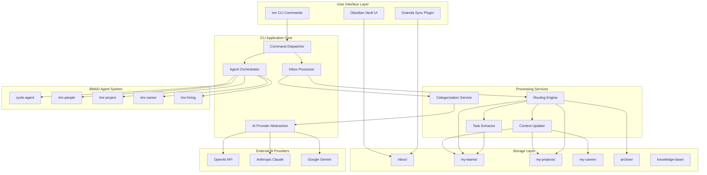
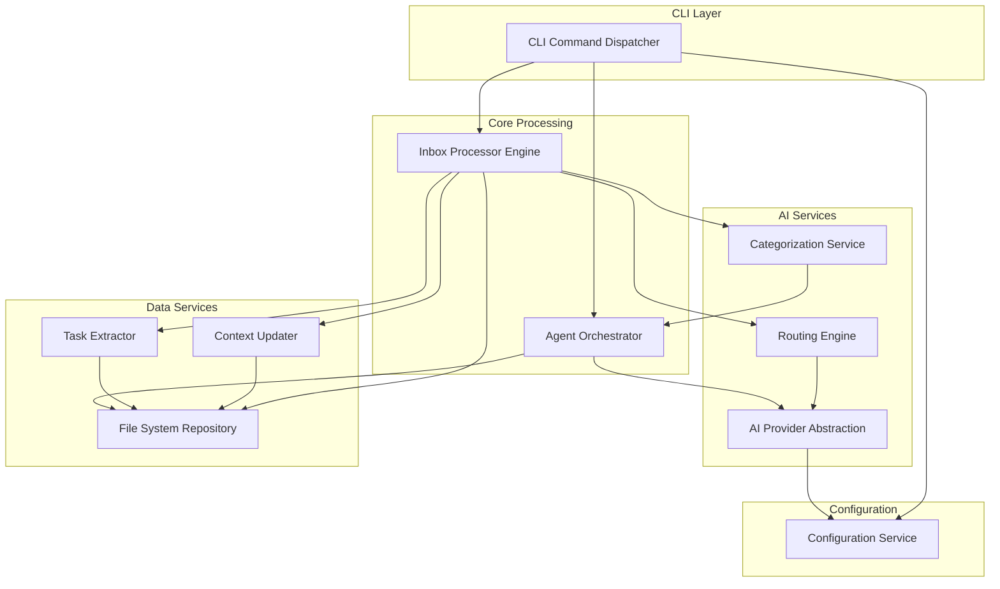
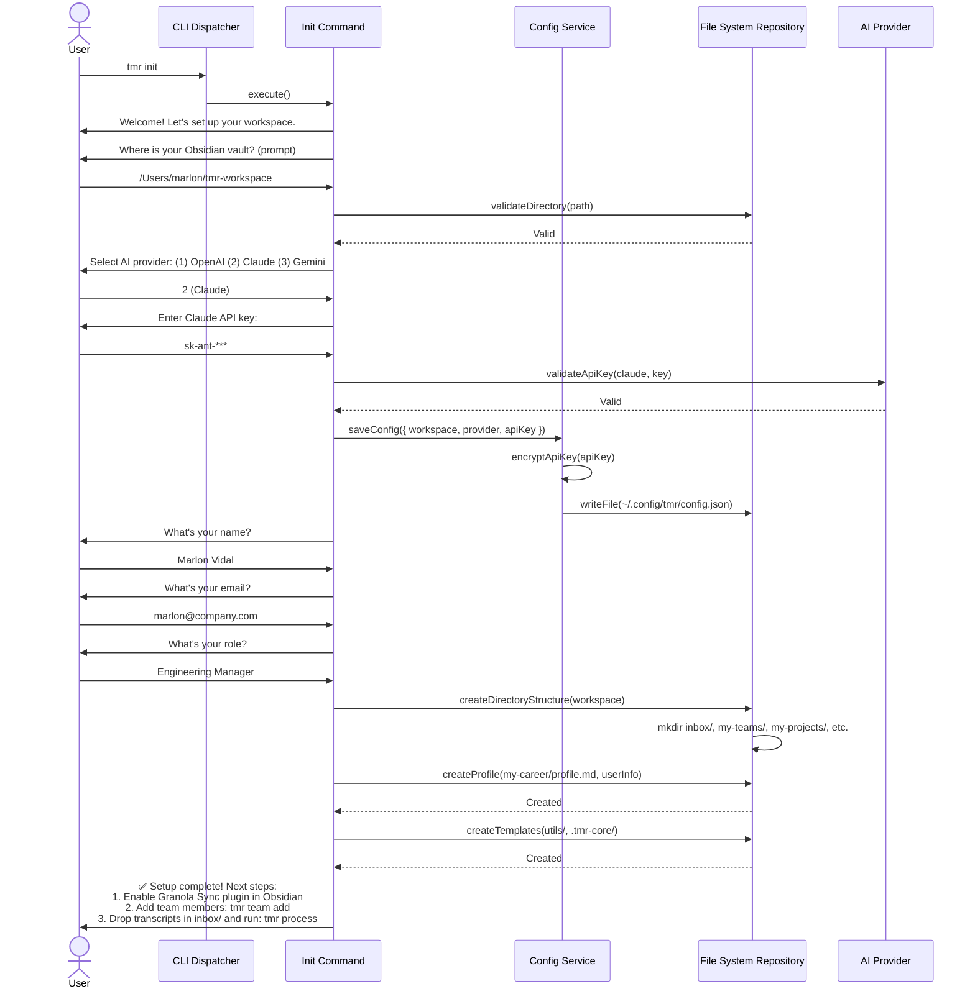
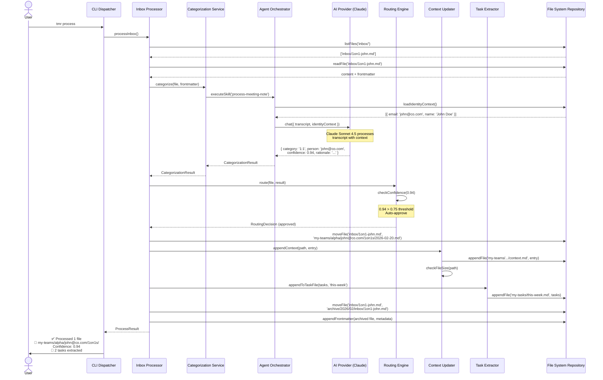
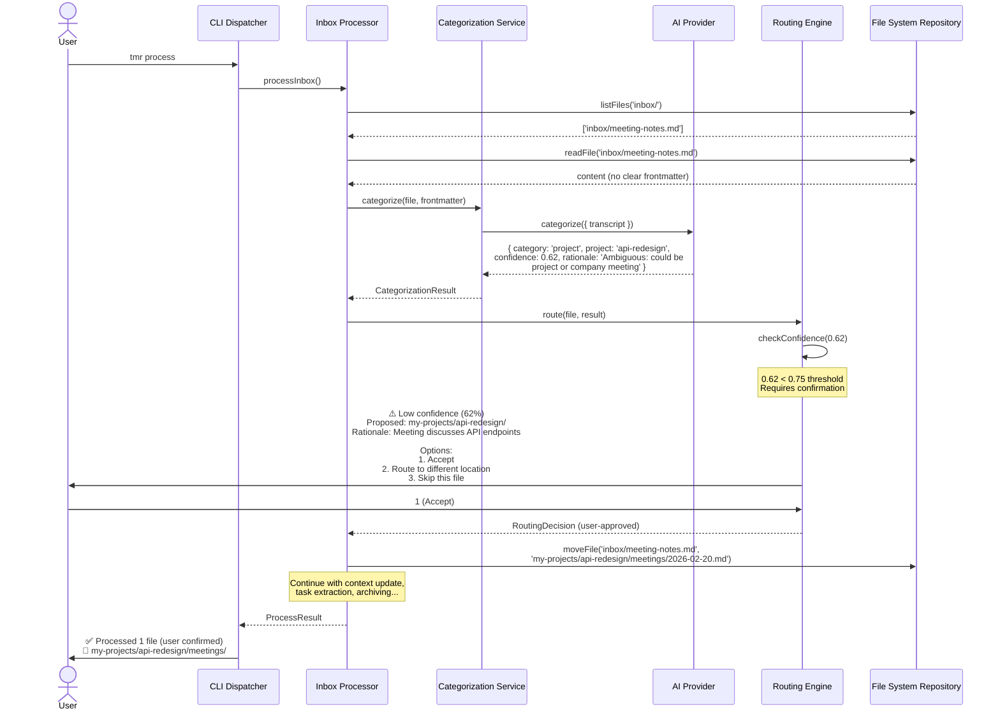
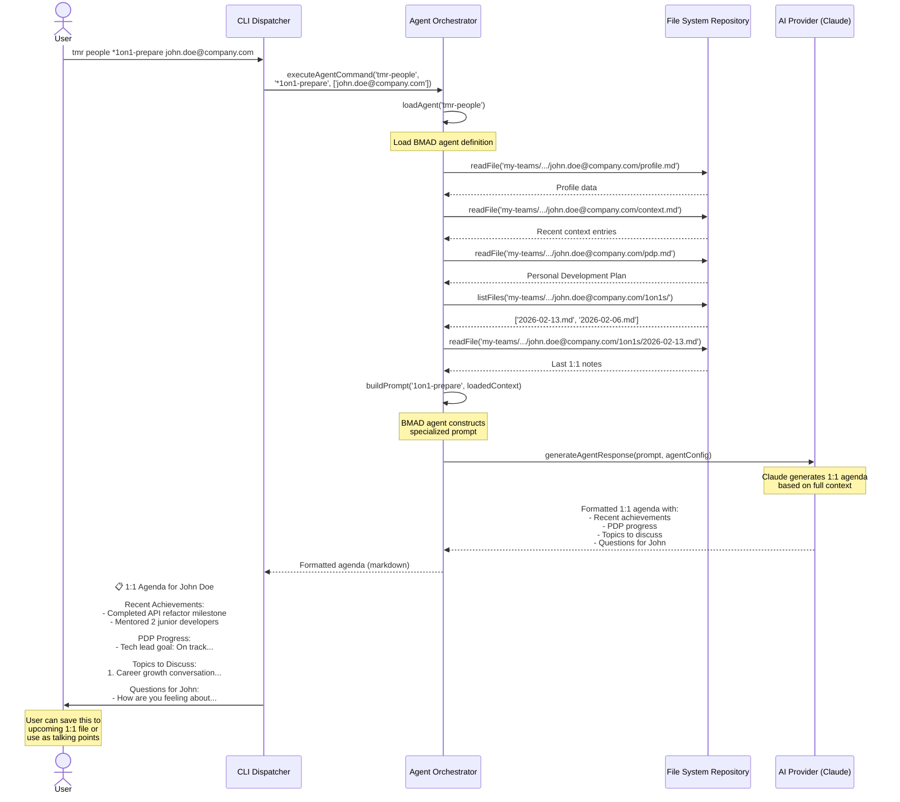
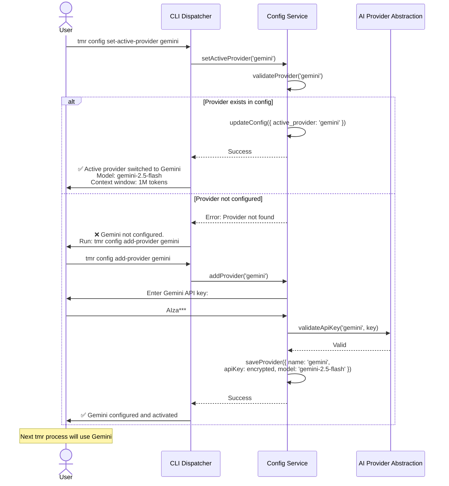
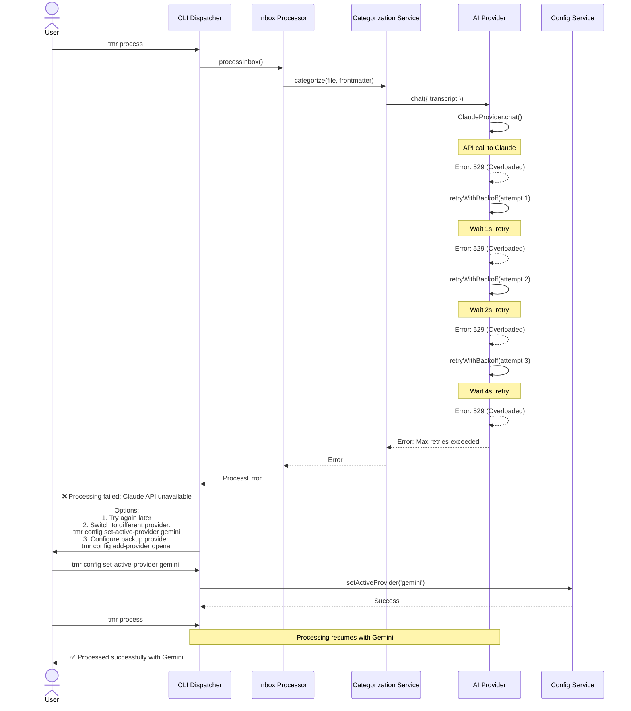

# Tech Leadership OS Architecture Document

## Introduction

This document outlines the overall project architecture for **Tech Leadership OS**, including backend systems, shared services, and non-UI specific concerns. Its primary goal is to serve as the guiding architectural blueprint for AI-driven development, ensuring consistency and adherence to chosen patterns and technologies.

**Relationship to Frontend Architecture:**
If the project includes a significant user interface, a separate Frontend Architecture Document will detail the frontend-specific design and MUST be used in conjunction with this document. Core technology stack choices documented herein (see "Tech Stack") are definitive for the entire project, including any frontend components.

### Starter Template or Existing Project

**Decision: Greenfield Development**

This project is being built from scratch with the following approach:

- **No existing codebase or starter template** - Fresh TypeScript CLI project
- **CLI Framework:** Commander.js (industry standard, used by npm, create-react-app, Vue CLI)
- **BMAD Builder Integration:** Will implement BMAD Builder framework (https://github.com/bmad-code-org/bmad-builder) as a core dependency for agent and skill system extensibility
- **Rationale:** Starting fresh allows us to architect specifically for local-first file operations, AI agent orchestration, and Obsidian integration without inherited constraints

### Change Log

| Date | Version | Description | Author |
|------|---------|-------------|---------|
| 2026-02-20 | 1.0 | Initial architecture document created | Winston (Architect) |

---

## High Level Architecture

### Technical Summary

Tech Leadership OS is a **local-first CLI and file system-based management workspace** built on Node.js/TypeScript. The architecture follows a **modular monolith pattern** with a command-driven interface (`tmr` CLI), local file system as the primary data store (Obsidian-compatible markdown), and AI agent orchestration powered by the BMAD Builder framework. The system integrates with multiple AI providers (OpenAI, Claude, Gemini) through a provider-agnostic abstraction layer with runtime provider switching support. Core components include: CLI command dispatcher, inbox processing engine, AI categorization service, context maintenance system, and agent orchestration. This architecture directly supports the PRD's goals of zero-latency insights, local-first privacy, and extensible agent-based intelligence while maintaining compatibility with Obsidian as the primary user interface.

### High Level Overview

**Architectural Style:** Modular Monolith with Plugin Architecture

1. **Main Architecture Style:**
   - **Modular Monolith** - Single deployable CLI application with well-defined internal modules
   - **Plugin-based extensibility** via BMAD Builder SKILL.md system
   - **Event-driven processing** for inbox monitoring and file operations
   - **Provider pattern** for AI abstraction (OpenAI/Claude/Gemini)

2. **Repository Structure:**
   - **Monorepo** - Single repository with clear module boundaries
   - Structure: `packages/cli/`, `packages/core/`, `packages/agents/`, `packages/skills/`

3. **Service Architecture:**
   - **Single-process CLI application** with modular internal architecture
   - **No distributed services** - all processing runs locally
   - **File system as database** - structured markdown files with frontmatter metadata
   - **Local-first, offline-capable** by design

4. **Primary User Interaction Flow:**
   - User drops files into `inbox/` (manually or via Granola sync)
   - User runs `tmr process` command (or `tmr watch` for automatic processing)
   - AI analyzes and categorizes each file with confidence scoring
   - System updates context files, extracts tasks, routes to appropriate folders
   - User interacts with Obsidian vault or runs specialized agent commands (`*1on1-prepare`, `*status-report`, etc.)

5. **Key Architectural Decisions:**
   - **Local file system over database:** Enables human readability, git versioning, Obsidian compatibility, zero vendor lock-in
   - **Append-only context updates:** O(1) AI token cost regardless of context size, user controls cleanup
   - **Confidence-gated routing:** Human-in-the-loop for ambiguous categorization decisions
   - **Single-pass AI processing:** Each transcript processed once with minimal context to control costs
   - **Email-as-identity convention:** Consistent `{email}.md` files enable Obsidian graph view resolution
   - **Multi-provider support with runtime switching:** Users can configure multiple AI providers (OpenAI, Claude, Gemini) and switch between them via `tmr config set-active-provider` without reconfiguration
   - **Pure file system for MVP:** Rely on Obsidian's native search capabilities; defer SQLite indexing to future versions if performance requirements emerge
   - **Manual context cleanup:** Defer automated context summarization (`tmr clean-context`) to future versions; users manage file growth manually in MVP

### High Level Project Diagram



### Architectural and Design Patterns

**Key Patterns Guiding the Architecture:**

- **Command Pattern:** CLI commands encapsulated as discrete handlers with validation and execution logic - _Rationale:_ Aligns with Commander.js best practices, enables testability and extensibility

- **Strategy Pattern (AI Provider Abstraction):** Interchangeable AI provider implementations (OpenAI, Claude, Gemini) behind common interface with runtime switching - _Rationale:_ Supports BYOK requirement (FR2) and multi-provider configuration, enables easy provider switching via `tmr config set-active-provider`

- **Plugin Architecture (BMAD Skills):** SKILL.md-based extensibility for community-driven features - _Rationale:_ Core requirement for extensibility (FR8), enables community contributions without modifying core code

- **Repository Pattern (File System Access):** Abstract file system operations behind consistent API - _Rationale:_ Enables testing with in-memory filesystem, potential future migration to database if needed

- **Event-Driven Processing:** File watcher emits events for inbox changes, handlers respond asynchronously - _Rationale:_ Supports `tmr watch` requirement (FR5), decouples detection from processing

- **Confidence-Based Human-in-the-Loop:** AI decisions include confidence scores; low-confidence triggers user confirmation - _Rationale:_ Balances automation with accuracy (FR4), builds user trust over time

- **Append-Only Context Pattern:** Context files grow by appending dated entries, never require full read for updates - _Rationale:_ Keeps token costs O(1) regardless of context size (PRD brainstorm outcomes)

---

## Tech Stack

### Cloud Infrastructure

**Provider:** **None (Local-First)**

**Key Services:** N/A - This is a local CLI application with no cloud infrastructure

**Deployment Regions:** N/A - Runs on user's local machine

**Note:** Future versions may add optional cloud sync features (similar to Obsidian Sync), but MVP is 100% local.

### Technology Stack Table

| Category | Technology | Version | Purpose | Rationale |
|----------|------------|---------|---------|-----------|
| **Runtime** | Node.js | 20.17.0 LTS | JavaScript runtime | LTS stability, BMAD Builder compatibility, widest ecosystem support |
| **Language** | TypeScript | 5.3.3 | Primary development language | Type safety, excellent tooling, IDE integration, team productivity |
| **Package Manager** | pnpm | 9.x | Dependency management and monorepo workspaces | Fastest installs, disk space efficiency, excellent monorepo support |
| **CLI Framework** | Commander.js | 12.x | Command-line interface structure | Industry standard (npm, create-react-app use it), extensible, well-documented |
| **Agent Framework** | BMAD Builder | Latest | Agent and skill system extensibility | PRD requirement, community-compatible agent definitions, standardized workflows |
| **AI SDK (OpenAI)** | openai | 4.x | OpenAI API client | Official SDK, streaming support, function calling |
| **AI SDK (Anthropic)** | @anthropic-ai/sdk | 0.28.x | Claude API client | Official SDK, prompt caching, streaming |
| **AI SDK (Google)** | @google/generative-ai | 0.21.x | Gemini API client | Official SDK, multimodal support |
| **Testing Framework** | Vitest | 1.x | Unit and integration testing | Fast, native TypeScript, modern DX, growing adoption |
| **Markdown Parser** | unified + remark | 11.x + 15.x | Markdown processing and AST manipulation | Obsidian compatibility, plugin ecosystem, wikilink support via remark-wiki-link |
| **Frontmatter Parser** | gray-matter | 4.x | YAML frontmatter extraction | Standard library, Obsidian-compatible, reliable |
| **File Watcher** | chokidar | 3.x | Inbox directory monitoring for `tmr watch` | Cross-platform, reliable, handles edge cases better than native fs.watch |
| **Configuration** | conf | 12.x | Cross-platform user config storage | Atomic writes, schema validation, XDG-compliant paths |
| **Encryption** | crypto-js | 4.x | API key encryption (primary) | Secure credential storage, no native dependencies, cross-platform |
| **Keychain Access** | keytar | 7.x | Native OS keychain integration (optional fallback) | Enhanced security via OS keychain, user opt-in for native storage |
| **CLI Styling** | chalk | 5.x | Terminal colors and styling | De facto standard, excellent compatibility, readable output |
| **CLI Progress** | ora | 8.x | Spinners and progress indicators | Beautiful UX, minimal overhead, widely used |
| **CLI Prompts** | inquirer | 9.x | Interactive prompts for `tmr init` | Rich prompt types, validation, well-tested |
| **Linting** | ESLint + @typescript-eslint | 8.x + 6.x | Code quality and consistency | TypeScript-aware linting, catches common errors |
| **Formatting** | Prettier | 3.x | Code formatting | Consistent style, zero-config for TypeScript, team standard |
| **Git Hooks** | husky | 9.x | Pre-commit code quality checks | Enforce linting/testing before commits, team discipline |
| **Build Tool** | tsup | 8.x | TypeScript bundling and compilation | Fast builds, ESM + CJS support, minification, simpler than Rollup |

**CRITICAL:** This table is the **single source of truth** for all technology choices. Any other document or code must reference these exact versions.

**Version Pinning Strategy:**
- Major versions specified in this document (e.g., `20.x`, `5.x`)
- `package.json` uses exact versions (e.g., `"typescript": "5.3.3"`) for reproducible builds
- Dependencies reviewed and updated quarterly after testing

---

## Data Models

### Core Data Models Overview

The system manages structured markdown files with YAML frontmatter as the primary data storage mechanism. All entities are represented as files and folders in the Obsidian vault, with `[[wikilink]]` notation for relationships.

**Design Principles:**
- **Email-as-identity:** All person entities use email as primary identifier with `{email}.md` files for Obsidian graph linking
- **Append-only context:** Context files grow by appending dated entries, never requiring full read for AI updates
- **Pre-filled examples:** Boilerplate commands (`tmr team add`, `tmr project add`) create files with example attributes to demonstrate structure and guide users
- **Obsidian-first:** All data structures optimized for human readability and Obsidian compatibility

### Model: Team Member

**Purpose:** Represents an individual contributor or team member being managed, including their profile, development plans, and interaction history.

**Key Attributes:**
- `email`: string (primary identifier) - Team member's email address
- `name`: string - Full name
- `role`: string - Current job title (e.g., "Senior Software Engineer")
- `team`: string - Team name (e.g., "alpha", "platform-team")
- `status`: enum["active", "inactive"] - Employment status
- `hire_date`: date - When they joined the team
- `skills`: string[] - Technical and soft skills
- `current_projects`: string[] - Active project assignments (references to Project entities)
- `manager_notes`: string - Private observations and context

**Relationships:**
- Belongs to one **Team**
- Has many **Context Entries** (1:1s, feedback, observations)
- Has one **PDP** (Personal Development Plan)
- Associated with multiple **Projects**
- Has many **Tasks** (assigned or delegated)

**File Structure:**
```
my-teams/{team}/{email}/
├── {email}.md              # Identity anchor for Obsidian linking
├── profile.md              # Contains all attributes above in frontmatter
├── context.md              # Append-only context entries
├── pdp.md                  # Personal Development Plan
├── 1on1s/                  # Meeting transcripts
├── feedback/               # Feedback sessions
└── reviews/                # Performance reviews
```

### Model: Project

**Purpose:** Represents a work initiative, feature, or program being tracked, including status, team allocation, risks, and context.

**Key Attributes:**
- `name`: string (primary identifier) - Project slug (e.g., "api-redesign")
- `display_name`: string - Human-readable name (e.g., "API Redesign Initiative")
- `team`: string - Owning team name
- `status`: enum["planning", "active", "at-risk", "completed", "paused"] - Project health
- `priority`: enum["P0", "P1", "P2", "P3"] - Priority level
- `start_date`: date - Project kickoff
- `target_date`: date - Expected completion
- `assigned_members`: string[] - Team member emails working on this project
- `stakeholders`: string[] - Emails of key stakeholders
- `description`: string - Brief project summary

**Relationships:**
- Belongs to one **Team**
- Has many **Context Entries** (status updates, risk assessments)
- Has many **Team Members** (assigned)
- Has many **Tasks** (project-related todos)
- Has many **Transcripts** (project meetings)

**File Structure:**
```
my-projects/{name}/
├── brief.md                # Contains all attributes above in frontmatter
├── context.md              # Append-only context entries
├── status-reports/         # Weekly status updates
├── risk-assessments/       # Risk analysis documents
├── meetings/               # Project-specific meeting notes
└── incidents/              # Post-mortems and incidents
```

### Model: Task

**Purpose:** Represents actionable items extracted from transcripts or manually created, organized by time horizon (today, this week, this month, this quarter).

**Key Attributes:**
- `id`: string - Unique identifier (generated)
- `title`: string - Task description
- `status`: enum["todo", "in-progress", "blocked", "done"] - Completion state
- `priority`: enum["urgent", "high", "medium", "low"] - Importance level
- `due_date`: date - Target completion date
- `source_file`: string - Path to transcript/file where task was extracted
- `assigned_to`: string - Email of person responsible (can be leader or team member)
- `related_project`: string - Associated project name (optional)
- `related_person`: string - Associated team member email (optional)
- `context`: string - Additional notes about the task

**Relationships:**
- Optionally linked to **Team Member**
- Optionally linked to **Project**
- Originated from **Transcript** (source file)

**File Structure:**
```
my-tasks/
├── today.md                # Urgent tasks (due today or overdue)
├── this-week.md            # Tasks due this week
├── this-month.md           # Tasks due this month
├── this-quarter.md         # Longer-term objectives
└── completed/              # Archive of completed tasks (optional)
```

**Example Task Format:**
```markdown
- [ ] **Review [[@john.doe@company.com]]'s PR** (P0) - Due: 2026-02-20
  - Source: [[my-teams/alpha/john.doe@company.com/1on1s/2026-02-19.md]]
  - Context: Needs urgent feedback before deployment
```

**Note on Pre-filled Examples:** Commands that create boilerplate structures (`tmr team add`, `tmr project add`) will generate files with example attributes pre-filled to serve as templates and guide users on proper usage.

### Model: Context Entry

**Purpose:** Individual append-only log entries that build up context files for people and projects. Never edited once written, only appended.

**Key Attributes:**
- `date`: date - When this entry was created
- `source_file`: string - Path to source transcript
- `summary`: string - AI-generated summary of interaction/event
- `topics`: string[] - Key topics covered (e.g., ["performance", "project-x-status"])
- `sentiment`: enum["positive", "neutral", "constructive", "concern"] - Tone of interaction
- `action_items`: string[] - Tasks extracted from this entry
- `notable_points`: string[] - Key takeaways or quotes

**Relationships:**
- Belongs to **Team Member** or **Project** (parent entity)
- References source **Transcript**

**Example Context Entry Format:**
```markdown
### 2026-02-20 | 1:1 Meeting
**Source:** [[my-teams/alpha/john.doe@company.com/1on1s/2026-02-19.md]]  
**Topics:** Career growth, API redesign progress  
**Sentiment:** Positive

Summary of the interaction goes here...

**Action Items:**
- [ ] Follow-up task 1
- [ ] Follow-up task 2
```

### Model: Leader

**Purpose:** Represents the manager's own leaders (skip-level, direct manager, VPs, C-suite), including their expectations, communication style, and alignment meetings.

**Key Attributes:**
- `email`: string (primary identifier) - Leader's email address
- `name`: string - Full name
- `role`: string - Leadership position (e.g., "VP of Engineering")
- `reporting_relationship`: enum["direct-manager", "skip-level", "dotted-line"] - Relationship type
- `communication_style`: string - How they prefer to communicate
- `priorities`: string[] - Their key focus areas
- `expectations`: string - What they expect from the manager

**Relationships:**
- Has many **Context Entries** (1:1s, alignment meetings)
- Has many **Transcripts** (leadership meetings)

**File Structure:**
```
my-leadership/{email}/
├── {email}.md              # Identity anchor for Obsidian linking
├── profile.md              # Contains all attributes above
├── alignments/             # 1:1 meeting notes
└── challenges/             # Difficult conversations or feedback received
```

### Model: Hiring Candidate

**Purpose:** Represents candidates in the recruitment pipeline.

**Key Attributes:**
- `email`: string (primary identifier) - Candidate's email
- `name`: string - Full name
- `role_applied`: string - Position applied for
- `stage`: enum["screening", "phone-screen", "onsite", "offer", "rejected", "accepted"] - Pipeline stage
- `resume_link`: string - Path to resume file

**Relationships:**
- Has many **Transcripts** (interview notes)

**File Structure:**
```
operations/hiring/candidates/{email}/
├── {email}.md              # Identity anchor
├── profile.md              # Candidate information
└── interviews/             # Interview transcripts
```

---

## Components

### Component Architecture Overview

The system follows a **modular monolith pattern** with clear separation of concerns. Components are organized into layers: CLI, Core Processing, AI Services, Data Services, and Configuration.

### Component: CLI Command Dispatcher

**Responsibility:** Entry point for all `tmr` commands. Parses command-line arguments, validates inputs, loads configuration, and delegates to appropriate handlers.

**Key Interfaces:**
- `tmr init` → InitCommand handler
- `tmr process` → InboxProcessorCommand handler
- `tmr watch` → WatchCommand handler
- `tmr team add/archive/fire` → TeamManagementCommand handler
- `tmr project add/archive` → ProjectManagementCommand handler
- `tmr config set-active-provider` → ConfigCommand handler
- `tmr today/this-week/this-month/this-quarter` → TaskViewCommand handler

**Dependencies:** 
- Commander.js for CLI parsing
- ConfigService for user settings
- All command handler modules

**Technology Stack:** TypeScript, Commander.js 12.x, Inquirer 9.x (for interactive prompts)

### Component: Inbox Processor Engine

**Responsibility:** Core processing logic for `tmr process` command. Orchestrates file scanning, AI categorization, routing decisions, context updates, and task extraction.

**Key Interfaces:**
- `processInbox(options?: ProcessOptions): Promise<ProcessResult>` - Main entry point
- `categorizeFile(filePath: string): Promise<CategoryResult>` - Single file categorization
- `routeFile(file: FileMetadata, category: Category): Promise<RoutingDecision>` - Determine destination
- `updateContexts(routingDecision: RoutingDecision): Promise<void>` - Append to context files

**Dependencies:**
- FileSystemRepository (file access)
- CategorizationService (AI-powered classification)
- RoutingEngine (routing logic)
- ContextUpdater (context file management)
- TaskExtractor (action item extraction)

**Technology Stack:** TypeScript, chokidar 3.x (for `tmr watch`), gray-matter 4.x (frontmatter parsing)

**Processing Flow:**
1. Scan `inbox/` for unprocessed files
2. For each file:
   - Parse frontmatter (Granola metadata)
   - Extract email addresses and convert to `[[@email]]` format
   - Call AI for categorization + confidence score via BMAD skill
   - If confidence < threshold: prompt user for confirmation
   - Route file to destination(s)
   - Update related context files via append
   - Extract and file tasks
   - Move original to `archive/` with processing metadata
3. Display processing summary with rationales

### Component: AI Provider Abstraction Layer

**Responsibility:** Unified interface for multiple AI providers (OpenAI, Claude, Gemini). Handles provider selection, API calls, streaming, error handling, and retry logic.

**Key Interfaces:**
- `categorize(transcript: string, context: MinimalContext): Promise<CategorizationResult>` - Categorize transcript
- `generateAgentResponse(prompt: string, agentConfig: AgentConfig): Promise<string>` - Agent command responses
- `extractTasks(content: string): Promise<Task[]>` - Task extraction
- `chat(messages: Message[]): Promise<string>` - Generic AI chat interface

**Dependencies:**
- `openai` 4.x SDK
- `@anthropic-ai/sdk` 0.28.x
- `@google/generative-ai` 0.21.x
- ConfigService (for active provider selection and API keys)

**Technology Stack:** TypeScript with Strategy Pattern implementation

**Provider Selection Logic:**
```typescript
interface AIProvider {
  name: 'openai' | 'claude' | 'gemini';
  categorize(input: string): Promise<CategorizationResult>;
  chat(messages: Message[]): Promise<string>;
}

class AIProviderFactory {
  static create(providerName: string, apiKey: string): AIProvider {
    switch (providerName) {
      case 'openai': return new OpenAIProvider(apiKey);
      case 'claude': return new ClaudeProvider(apiKey);
      case 'gemini': return new GeminiProvider(apiKey);
    }
  }
}
```

### Component: Categorization Service

**Responsibility:** Delegates transcript categorization to BMAD skills (specifically `process-meeting-note` skill). Acts as bridge between Inbox Processor and Agent Orchestrator.

**Key Interfaces:**
- `categorize(file: FileContent, frontmatter: Frontmatter): Promise<CategorizationResult>` - Main categorization entry point

**Dependencies:**
- AgentOrchestrator (to execute BMAD skills)
- FileSystemRepository (to load lightweight identity context)

**Technology Stack:** TypeScript

**Categorization Result Structure:**
```typescript
interface CategorizationResult {
  primaryDestination: string;
  secondaryDestinations: string[];
  confidence: number;
  rationale: string;
  contextUpdates: Array<{
    path: string;
    summary: string;
    topics: string[];
    sentiment: string;
  }>;
  taskExtracts: Task[];
}
```

### Component: Routing Engine

**Responsibility:** Implements confidence-based routing decisions with human-in-the-loop for low-confidence categorizations. Validates destination paths exist.

**Key Interfaces:**
- `route(file: FileMetadata, category: CategoryResult): Promise<RoutingDecision>` - Main routing logic
- `calculateConfidence(category: CategoryResult): number` - Confidence scoring
- `promptUserConfirmation(decision: RoutingDecision): Promise<boolean>` - User approval for low-confidence routes

**Dependencies:**
- FileSystemRepository (to check if destinations exist)
- ConfigService (for confidence threshold settings)

**Technology Stack:** TypeScript, Inquirer 9.x (for user prompts)

### Component: Context Updater

**Responsibility:** Manages append-only updates to `context.md` files for team members, projects, and leaders. Formats context entries consistently and monitors file sizes.

**Key Interfaces:**
- `appendContext(entityPath: string, entry: ContextEntry): Promise<void>` - Append new entry
- `formatContextEntry(entry: ContextEntry): string` - Format entry as markdown
- `checkFileSize(filePath: string): Promise<FileSizeWarning | null>` - Warn on large files (>500KB)

**Dependencies:**
- FileSystemRepository (file I/O)

**Technology Stack:** TypeScript

**File Size Thresholds:**
- Individual transcripts: 50 KB warning
- Context files: 500 KB warning
- Profile files: 10 KB warning

### Component: Task Extractor

**Responsibility:** Processes task extracts from categorization results, categorizes by time horizon, and appends to appropriate task files.

**Key Interfaces:**
- `categorizeByTimeHorizon(task: Task): TimeHorizon` - Determine urgency based on due date
- `appendToTaskFile(task: Task, horizon: TimeHorizon): Promise<void>` - Add to appropriate task list

**Dependencies:**
- FileSystemRepository (to update task files)

**Technology Stack:** TypeScript

**Time Horizon Rules:**
- `today`: Due date is today or overdue
- `this-week`: Due within 7 days
- `this-month`: Due within 30 days
- `this-quarter`: Due within 90 days

### Component: Agent Orchestrator

**Responsibility:** Loads and executes BMAD Builder agent definitions and skills. Manages agent context, command routing, and skill execution.

**Key Interfaces:**
- `loadAgents(agentDir: string): Promise<AgentRegistry>` - Load all BMAD agents from `.tmr-core/agents/`
- `executeAgentCommand(agentId: string, command: string, args: string[]): Promise<string>` - Run agent command
- `executeSkill(skillName: string, context: SkillContext): Promise<any>` - Execute BMAD skill

**Dependencies:**
- BMAD Builder framework (agent parsing and execution)
- AIProviderAbstraction (for agent AI calls)
- FileSystemRepository (to load agent context)

**Technology Stack:** TypeScript, BMAD Builder integration

**Agent Examples:**
- `tmr-people`: Commands like `*1on1-prepare`, `*feedback`, `*pdp-generate`
- `tmr-project`: Commands like `*status-report`, `*risk-assessment`
- `tmr-career`: Commands like `*brag-summarize`, `*self-review`
- `cycle-agent`: Inbox processing coordination

### Component: File System Repository

**Responsibility:** Abstracts all file system operations behind a consistent interface. Enables testing with in-memory filesystem and potential future database migration.

**Key Interfaces:**
- `readFile(path: string): Promise<string>` - Read file contents
- `writeFile(path: string, content: string): Promise<void>` - Write file
- `appendFile(path: string, content: string): Promise<void>` - Append to file
- `ensureDir(path: string): Promise<void>` - Create directory if not exists
- `moveFile(source: string, dest: string): Promise<void>` - Move file (for archiving)
- `listFiles(dir: string, pattern?: string): Promise<string[]>` - List directory contents
- `parseFrontmatter(filePath: string): Promise<Frontmatter>` - Extract YAML frontmatter
- `appendFrontmatter(filePath: string, fields: object): Promise<void>` - Add frontmatter fields

**Dependencies:**
- fs-extra (enhanced filesystem operations)
- gray-matter 4.x (frontmatter parsing)
- unified + remark (for markdown processing)

**Technology Stack:** TypeScript, Repository Pattern

### Component: Configuration Service

**Responsibility:** Manages user configuration including active AI provider, API keys, workspace paths, and processing preferences.

**Key Interfaces:**
- `getActiveProvider(): Promise<ProviderConfig>` - Get current AI provider
- `setActiveProvider(name: string): Promise<void>` - Switch provider
- `addProvider(name: string, apiKey: string, model: string): Promise<void>` - Configure new provider
- `getWorkspacePath(): Promise<string>` - Get Obsidian vault path
- `getConfidenceThreshold(): Promise<number>` - Get routing confidence threshold (default: 0.75)
- `setConfig(key: string, value: any): Promise<void>` - Generic config setter

**Dependencies:**
- `conf` 12.x (cross-platform config storage)
- `crypto-js` 4.x (API key encryption)
- `keytar` 7.x (optional native keychain fallback)

**Technology Stack:** TypeScript

**Config File Location:** `~/.config/tmr/config.json` (XDG-compliant on Linux/macOS, AppData on Windows)

### Component Interaction Diagram



---

## External APIs

### External API: OpenAI API

**Purpose:** Provides GPT-5 language models for transcript categorization, task extraction, and agent responses when OpenAI is the active provider.

**Documentation:** https://platform.openai.com/docs/api-reference

**Base URL(s):** `https://api.openai.com/v1`

**Authentication:** Bearer token (API key) in `Authorization` header

**Rate Limits:** 
- Free tier: 3 RPM, 40,000 TPM
- Tier 1 ($5+ spent): 500 RPM, 200,000 TPM
- Tier 5 ($1,000+ spent): 10,000 RPM, 5,000,000 TPM

**Key Endpoints Used:**
- `POST /v1/chat/completions` - Main endpoint for categorization and agent responses
  - Supports streaming for real-time responses
  - Function calling for structured outputs
  - Structured outputs via JSON schema (`response_format`)

**Available Models (2026):**
- **gpt-5-mini** - Fast and cost-effective (400K context, 128K output) - **Recommended for MVP**
- **gpt-5-nano** - Ultra-fast responses (400K context, 128K output)
- **gpt-5-pro** - Advanced reasoning with "reasoning_effort" parameter (best for complex tasks)
- **gpt-5** - General purpose flagship model

**Integration Notes:**
- **Recommended:** Use `gpt-5-mini` for balance of speed and quality
- Implement exponential backoff for rate limit errors (429)
- Handle token limits gracefully - truncate long transcripts if needed
- Enable streaming for agent commands to improve perceived latency
- Use structured outputs via JSON schema for consistent categorization results
- Cost: ~$0.05 per 1M input tokens (gpt-5-nano), ~$0.40 per 1M output tokens

---

### External API: Anthropic Claude API

**Purpose:** Provides Claude 4.x models for transcript categorization, task extraction, and agent responses when Claude is the active provider.

**Documentation:** https://docs.anthropic.com/claude/reference/getting-started-with-the-api

**Base URL(s):** `https://api.anthropic.com/v1`

**Authentication:** `x-api-key` header with API key

**Rate Limits:**
- Tier 1 (default): 50 RPM, 40,000 TPM
- Tier 4 ($1,000+ spent): 4,000 RPM, 400,000 TPM

**Key Endpoints Used:**
- `POST /v1/messages` - Main endpoint for categorization and agent responses
  - Supports prompt caching (cache frequently used context like agent personas)
  - Streaming support via Server-Sent Events

**Available Models (2026):**
- **claude-sonnet-4-5-20250929** - Best for real-world agents and coding - **Recommended for MVP**
- **claude-haiku-4-5-20251001** - Fastest hybrid model (near-instant + extended thinking)
- **claude-opus-4-1-20250805** - Most capable model for complex reasoning
- **claude-sonnet-4-20250514** - High-performance with extended thinking
- **Legacy:** claude-3-opus-20240229, claude-3-haiku-20240307 (deprecated)

**Context Windows:**
- Standard: 200K tokens
- Beta: 1M token context window available

**Integration Notes:**
- **Recommended:** `claude-sonnet-4-5-20250929` (best cost/performance balance for agents and coding)
- Use prompt caching for agent system prompts - reduces costs by 90% on cached tokens
- Claude has superior instruction following for structured outputs
- Handle 529 errors (overloaded) with retry logic
- Maximum 5 retries per request with exponential backoff
- Extended thinking capability enables complex reasoning tasks
- Max output: 64K tokens (Sonnet 4.6), 128K tokens (Opus 4.6)

---

### External API: Google Gemini API

**Purpose:** Provides Gemini 2.5 models for transcript categorization, task extraction, and agent responses when Gemini is the active provider.

**Documentation:** https://ai.google.dev/gemini-api/docs

**Base URL(s):** 
- `https://generativelanguage.googleapis.com/v1beta`
- OpenAI-compatible endpoint: `https://generativelanguage.googleapis.com/v1beta/openai`

**Authentication:** API key as query parameter `?key={API_KEY}` OR `Authorization: Bearer {API_KEY}` header (OpenAI-compatible endpoint)

**Rate Limits:**
- Free tier: 15 RPM, 32,000 TPM, 1,500 RPD
- Paid tier: 360 RPM, 4,000,000 TPM

**Key Endpoints Used:**
- `POST /v1beta/models/{model}:generateContent` - Main endpoint for text generation
- `POST /v1beta/models/{model}:streamGenerateContent` - Streaming variant
- `GET /v1beta/openai/models` - List available models (OpenAI-compatible)

**Available Models (2026):**
- **gemini-2.5-flash** - Production-ready, general purpose (1M context, 65K output) - **Recommended for MVP**
- **gemini-2.5-flash-lite** - Lightweight, efficient (1M context, 65K output)
- **gemini-2.5-pro** - State-of-the-art reasoning for complex problems (1M context, 65K output)
- **gemini-3-flash-preview** - Next-gen preview model (experimental)
- **Deprecated:** gemini-2.0-flash (shutdown March 31, 2026)

**Integration Notes:**
- **Recommended:** `gemini-2.5-flash` (best balance, multimodal support, 1M context window)
- Multimodal support available (future: process image/video attachments from meetings)
- Free tier is generous for MVP testing (15 RPM sufficient for initial users)
- JSON mode for structured outputs (`response_mime_type: "application/json"`)
- Handles longer context windows exceptionally well (1M tokens)
- Supports comprehensive capabilities: function calling, code execution, caching, structured outputs, thinking mode
- Latest update: June 2025, Knowledge cutoff: January 2025

---

### External API: Granola (Indirect Integration)

**Purpose:** Meeting transcription tool that syncs transcripts to Obsidian vault via plugin. Tech Leadership OS consumes Granola output but doesn't directly call Granola APIs.

**Documentation:** https://www.granola.so/obsidian

**Integration Method:** File-based (Granola Sync Obsidian plugin writes to `inbox/`)

**Expected File Format:**
```markdown
---
granola_id: abc123
title: "1:1 with John Doe"
date: 2026-02-19
attendees:
  - john.doe@company.com
  - marlon@company.com
type: meeting
---

# 1:1 with John Doe

## Transcript

[Transcript content here...]
```

**Integration Notes:**
- Granola plugin writes files directly to `inbox/` folder
- Frontmatter fields are primary routing signals for `process-meeting-note` skill
- `attendees` field automatically extracted and converted to `[[@email]]` links
- No API key required - purely file-based integration
- User must manually enable Granola Sync plugin in Obsidian

---

### AI Provider Comparison Matrix (2026)

| Feature | OpenAI | Claude | Gemini |
|---------|--------|--------|--------|
| **Recommended Model** | gpt-5-mini | claude-sonnet-4-5-20250929 | gemini-2.5-flash |
| **Context Window** | 400K tokens | 200K (1M beta) | 1M tokens |
| **Max Output** | 128K tokens | 64K tokens (Sonnet) | 65K tokens |
| **Cost (per 1M input)** | $0.05 (gpt-5-mini) | ~$3 (Sonnet 4.5) | Free tier / $0.075 (Flash) |
| **Streaming** | ✅ Yes | ✅ Yes | ✅ Yes |
| **Function Calling** | ✅ Yes | ✅ Yes (Tool Use) | ✅ Yes |
| **Structured Outputs** | ✅ JSON schema | ✅ Via prompting | ✅ JSON mode |
| **Caching** | ❌ No | ✅ Prompt caching (90% discount) | ✅ Yes |
| **Extended Thinking** | ✅ Yes (gpt-5-pro) | ✅ Yes (all 4.x models) | ✅ Yes (thinking mode) |
| **Multimodal** | ✅ Audio, Image | ✅ Audio, Image, Video | ✅ Audio, Image, Video, PDF |
| **Rate Limits (Paid)** | 500 RPM (Tier 1) | 50 RPM (Tier 1) | 360 RPM (Paid) |
| **Best For** | Structured outputs, speed | Agents, coding, instruction following | Cost optimization, long context, multimodal |

**Recommendation Priority for Tech Leadership OS:**
1. **Claude Sonnet 4.5** - Best for agent workflows and coding tasks, excellent instruction following
2. **Gemini 2.5 Flash** - Most cost-effective with 1M context, excellent for long transcripts
3. **GPT-5 Mini** - Good balance if user prefers OpenAI ecosystem

---

### `tmr process` Command - Complete Execution Flow

This diagram shows the detailed method call chain when a user runs `tmr process`:

```
┌─────────────────────────────────────────────────────────────────────┐
│ USER ACTION: tmr process                                            │
└─────────────────────────────────────────────────────────────────────┘
                              │
                              ▼
┌─────────────────────────────────────────────────────────────────────┐
│ 1. CLI ENTRY POINT                                                  │
│    CLICommandDispatcher.parse()                                     │
│    ├─> Commander.js parses arguments                               │
│    └─> InboxProcessorCommand.execute()                             │
└─────────────────────────────────────────────────────────────────────┘
                              │
                              ▼
┌─────────────────────────────────────────────────────────────────────┐
│ 2. INBOX SCANNING                                                   │
│    InboxProcessorEngine.processInbox()                              │
│    └─> FileSystemRepository.listFiles('inbox/')                    │
│        Returns: ['inbox/meeting-with-john.md',                     │
│                  'inbox/project-update.md']                         │
└─────────────────────────────────────────────────────────────────────┘
                              │
                              ▼
┌─────────────────────────────────────────────────────────────────────┐
│ 3. FOR EACH FILE - CATEGORIZATION PHASE                            │
│                                                                      │
│    FileSystemRepository.readFile(file)                              │
│    FileSystemRepository.parseFrontmatter(file)                      │
│    ├─> Returns: { granola_id, title, date, attendees, type }      │
│    │                                                                 │
│    └─> CategorizationService.categorize(file, frontmatter)         │
│        │                                                             │
│        ├─> AgentOrchestrator.executeSkill('process-meeting-note')  │
│        │   │                                                         │
│        │   ├─> Load lightweight identity context:                   │
│        │   │   FileSystemRepository.listFiles('my-teams/**/*/profile.md')│
│        │   │   Extract: emails + names only (not full context)      │
│        │   │                                                         │
│        │   ├─> BMAD Skill builds specialized prompt                 │
│        │   │                                                         │
│        │   └─> AIProviderAbstraction.categorize({                   │
│        │         transcript: fileContent,                           │
│        │         identityContext: { emails, names },                │
│        │         model: activeProvider                              │
│        │       })                                                    │
│        │       │                                                     │
│        │       ├─> ConfigService.getActiveProvider()                │
│        │       │   Returns: { name: 'claude', apiKey: '...', model: 'claude-sonnet-4-5-20250929' }│
│        │       │                                                     │
│        │       └─> ClaudeProvider.chat() OR OpenAIProvider.chat() OR GeminiProvider.chat()│
│        │           │                                                 │
│        │           └─> **EXTERNAL API CALL**                        │
│        │               POST https://api.anthropic.com/v1/messages   │
│        │               (or OpenAI/Gemini equivalent)                 │
│        │               │                                             │
│        │               Returns: {                                   │
│        │                 category: '1:1',                            │
│        │                 person: 'john.doe@company.com',            │
│        │                 project: null,                              │
│        │                 topics: ['career', 'performance'],          │
│        │                 confidence: 0.92,                           │
│        │                 rationale: 'Meeting titled "1:1 with John"'│
│        │               }                                             │
│        │                                                             │
│        └─> BMAD Skill formats AI response into:                    │
│            CategorizationResult {                                   │
│              primaryDestination: 'my-teams/alpha/john.doe@company.com/1on1s/',│
│              secondaryDestinations: [],                             │
│              contextUpdates: [{                                     │
│                path: 'my-teams/alpha/john.doe@company.com/context.md',│
│                summary: '...',                                      │
│                topics: ['career', 'performance'],                   │
│                sentiment: 'positive'                                 │
│              }],                                                     │
│              taskExtracts: [{                                       │
│                title: 'Review performance goals',                   │
│                due: '2026-02-25',                                   │
│                priority: 'high'                                     │
│              }],                                                     │
│              confidence: 0.92,                                      │
│              rationale: '...'                                       │
│            }                                                         │
└─────────────────────────────────────────────────────────────────────┘
                              │
                              ▼
┌─────────────────────────────────────────────────────────────────────┐
│ 4. ROUTING DECISION PHASE                                           │
│                                                                      │
│    RoutingEngine.route(file, categorizationResult)                  │
│    │                                                                 │
│    ├─> Check confidence threshold                                   │
│    │   if (confidence < 0.75):                                     │
│    │     RoutingEngine.promptUserConfirmation(decision)             │
│    │     ├─> Display: "Confidence: 0.65 - Is this correct?"       │
│    │     └─> Wait for user input (approve/modify)                  │
│    │                                                                 │
│    └─> Returns: RoutingDecision (approved or user-modified)        │
└─────────────────────────────────────────────────────────────────────┘
                              │
                              ▼
┌─────────────────────────────────────────────────────────────────────┐
│ 5. FILE ROUTING EXECUTION                                           │
│                                                                      │
│    FileSystemRepository.moveFile(                                   │
│      'inbox/meeting-with-john.md',                                 │
│      'my-teams/alpha/john.doe@company.com/1on1s/2026-02-19.md'    │
│    )                                                                 │
└─────────────────────────────────────────────────────────────────────┘
                              │
                              ▼
┌─────────────────────────────────────────────────────────────────────┐
│ 6. CONTEXT UPDATE PHASE (Append-Only)                              │
│                                                                      │
│    for (contextUpdate in categorizationResult.contextUpdates):     │
│      │                                                               │
│      ├─> ContextUpdater.appendContext(                             │
│      │     path: 'my-teams/alpha/john.doe@company.com/context.md', │
│      │     entry: {                                                 │
│      │       date: '2026-02-20',                                   │
│      │       source: '[[...1on1s/2026-02-19.md]]',                │
│      │       summary: contextUpdate.summary,                        │
│      │       topics: contextUpdate.topics,                          │
│      │       sentiment: contextUpdate.sentiment                     │
│      │     }                                                         │
│      │   )                                                           │
│      │   │                                                           │
│      │   ├─> ContextUpdater.formatContextEntry(entry)              │
│      │   │   Returns: markdown-formatted entry                      │
│      │   │                                                           │
│      │   └─> FileSystemRepository.appendFile(                      │
│      │         'my-teams/.../context.md',                           │
│      │         formattedEntry                                       │
│      │       )                                                       │
│      │                                                               │
│      └─> ContextUpdater.checkFileSize(path)                        │
│          if (fileSize > 500KB):                                    │
│            Display warning: "⚠️ Context file >500KB, consider archiving"│
└─────────────────────────────────────────────────────────────────────┘
                              │
                              ▼
┌─────────────────────────────────────────────────────────────────────┐
│ 7. TASK EXTRACTION PHASE                                            │
│                                                                      │
│    for (task in categorizationResult.taskExtracts):                │
│      │                                                               │
│      ├─> TaskExtractor.categorizeByTimeHorizon(task)               │
│      │   if (task.due == today OR overdue): return 'today'         │
│      │   if (task.due <= 7 days): return 'this-week'              │
│      │   if (task.due <= 30 days): return 'this-month'            │
│      │   else: return 'this-quarter'                               │
│      │   Returns: 'this-week'                                      │
│      │                                                               │
│      └─> TaskExtractor.appendToTaskFile(task, 'this-week')         │
│          │                                                           │
│          └─> FileSystemRepository.appendFile(                      │
│                'my-tasks/this-week.md',                             │
│                formattedTaskEntry                                   │
│              )                                                       │
└─────────────────────────────────────────────────────────────────────┘
                              │
                              ▼
┌─────────────────────────────────────────────────────────────────────┐
│ 8. ARCHIVE PHASE                                                    │
│                                                                      │
│    FileSystemRepository.moveFile(                                   │
│      'inbox/meeting-with-john.md',                                 │
│      'archive/2026/02/inbox/meeting-with-john.md'                  │
│    )                                                                 │
│    │                                                                 │
│    └─> FileSystemRepository.appendFrontmatter(                     │
│          'archive/2026/02/inbox/meeting-with-john.md',             │
│          {                                                           │
│            processed: true,                                         │
│            processed_date: '2026-02-20',                           │
│            routed_to: ['my-teams/.../1on1s/2026-02-19.md']        │
│          }                                                           │
│        )                                                             │
└─────────────────────────────────────────────────────────────────────┘
                              │
                              ▼
┌─────────────────────────────────────────────────────────────────────┐
│ 9. PROCESS LOG (Optional)                                           │
│                                                                      │
│    if (config.process_log_enabled):                                │
│      FileSystemRepository.appendFile(                               │
│        'my-tasks/process-log.md',                                   │
│        processLogEntry                                              │
│      )                                                               │
└─────────────────────────────────────────────────────────────────────┘
                              │
                              ▼
┌─────────────────────────────────────────────────────────────────────┐
│ 10. DISPLAY PROCESSING SUMMARY                                      │
│                                                                      │
│     ✅ Processed 2 files                                           │
│     📁 Routed:                                                      │
│       - meeting-with-john.md → my-teams/.../1on1s/ (confidence: 0.92)│
│       - project-update.md → my-projects/api-redesign/ (confidence: 0.88)│
│     📝 Extracted 3 tasks                                            │
│     ⚠️  1 warning: context.md file size approaching 500KB          │
└─────────────────────────────────────────────────────────────────────┘
```

**Key Observations:**
- **Single AI call per transcript** - BMAD skill makes one API call that returns complete manifest
- **O(1) token cost** - Only new transcript + lightweight identity context sent to AI
- **Append-only updates** - Context files never read during processing, only appended
- **Confidence-gated** - Human confirmation required for low-confidence routing
- **Atomic operations** - All file operations complete or fail together

---

## Core Workflows

### Workflow 1: User Initialization (`tmr init`)

This sequence diagram illustrates the interactive onboarding workflow when a new user initializes Tech Leadership OS.



---

### Workflow 2: Inbox Processing with High Confidence

This sequence shows successful automatic processing when AI categorization confidence exceeds threshold.



---

### Workflow 3: Inbox Processing with Low Confidence (User Confirmation)

This sequence shows human-in-the-loop processing when AI categorization confidence is below threshold.



---

### Workflow 4: Agent Command Execution (`*1on1-prepare`)

This sequence shows how specialized agent commands work with pre-loaded context.



---

### Workflow 5: AI Provider Switching

This sequence shows how users can switch between AI providers at runtime.



---

### Workflow 6: Error Handling - AI Provider Failure

This sequence shows graceful degradation when an AI provider is unavailable.



---

## Database Schema

Tech Leadership OS uses the **file system as the database** with structured markdown files and YAML frontmatter. This section defines the "schema" through file structure and frontmatter specifications.

### Team Member Schema

**File:** `my-teams/{team}/{email}/profile.md`

```yaml
---
email: john.doe@company.com
name: John Doe
role: Senior Software Engineer
team: alpha
status: active
hire_date: 2024-03-15
skills:
  - TypeScript
  - React
  - System Design
current_projects:
  - "[[api-redesign]]"
  - "[[mobile-app]]"
manager_notes: Strong technical skills, interested in tech lead role
---

# John Doe - Profile

## Background
[Additional details...]
```

**Identity Anchor:** `my-teams/{team}/{email}/{email}.md` (enables Obsidian `[[@email]]` linking)

---

### Project Schema

**File:** `my-projects/{project}/brief.md`

```yaml
---
name: api-redesign
display_name: API Redesign Initiative
team: alpha
status: active
priority: P0
start_date: 2026-01-15
target_date: 2026-04-30
assigned_members:
  - "[[@john.doe@company.com]]"
  - "[[@jane.smith@company.com]]"
stakeholders:
  - "[[@cto@company.com]]"
description: Complete overhaul of REST API to GraphQL
---

# API Redesign Initiative

## Overview
[Project details...]
```

---

### Context Entry Schema

**File:** `my-teams/{team}/{email}/context.md` or `my-projects/{project}/context.md`

```markdown
---
last_updated: 2026-02-20
total_entries: 47
---

## Context Entries

### 2026-02-20 | 1:1 Meeting
**Source:** [[my-teams/alpha/john.doe@company.com/1on1s/2026-02-19.md]]  
**Topics:** Career growth, API redesign progress, team dynamics  
**Sentiment:** Positive

John expressed interest in taking on tech lead responsibilities. Discussed readiness signals: mentoring junior developers, driving architectural decisions, and improving communication skills. Agreed to shadow Sarah on next architecture review.

**Action Items:**
- [ ] John to lead next sprint planning
- [ ] Schedule shadowing session with Sarah

**Notable:** "I feel ready to step up, but want to make sure I'm not leaving gaps in my current work."

---
```

---

### Task Schema

**File:** `my-tasks/this-week.md`, `my-tasks/today.md`, etc.

```markdown
---
view: task-list
last_updated: 2026-02-20
---

## This Week's Tasks

- [ ] **Review [[@john.doe@company.com]]'s PR** (P0) - Due: 2026-02-22
  - Source: [[my-teams/alpha/john.doe@company.com/1on1s/2026-02-19.md]]
  - Context: Needs feedback before deployment
  - Related: [[api-redesign]]

- [ ] **Prepare Q1 status report** (P1) - Due: 2026-02-25
  - Source: [[my-leadership/vp@company.com/alignments/2026-02-18.md]]
  - Context: Quarterly business review preparation

- [x] **Complete John's PDP review** (P2) - Due: 2026-02-20
  - Source: [[my-teams/alpha/john.doe@company.com/1on1s/2026-02-13.md]]
  - Completed: 2026-02-20
```

---

### Leader Schema

**File:** `my-leadership/{email}/profile.md`

```yaml
---
email: vp.engineering@company.com
name: Sarah Johnson
role: VP of Engineering
reporting_relationship: direct-manager
communication_style: Direct, data-driven, appreciates written updates
priorities:
  - Team growth and retention
  - Technical excellence
  - Delivery predictability
expectations: Weekly status updates, proactive escalation, team development focus
---

# Sarah Johnson - VP of Engineering

## Communication Preferences
- Prefers async updates via written docs
- Weekly 1:1s on Mondays at 2pm
- Appreciates data-backed decisions

## Key Focus Areas
[Additional context...]
```

---

### Configuration Schema

**File:** `~/.config/tmr/config.json`

```json
{
  "version": "1.0.0",
  "workspace_path": "/Users/marlon/tmr-workspace",
  "active_provider": "claude",
  "confidence_threshold": 0.75,
  "process_log_enabled": false,
  "providers": {
    "openai": {
      "model": "gpt-5-mini",
      "api_key_encrypted": "U2FsdGVkX1...",
      "configured_date": "2026-02-20"
    },
    "claude": {
      "model": "claude-sonnet-4-5-20250929",
      "api_key_encrypted": "U2FsdGVkX1...",
      "configured_date": "2026-02-20"
    },
    "gemini": {
      "model": "gemini-2.5-flash",
      "api_key_encrypted": "U2FsdGVkX1...",
      "configured_date": "2026-02-20"
    }
  }
}
```

---

### Archive Metadata Schema

**File:** `archive/{year}/{month}/inbox/{filename}.md`

Original file with appended frontmatter:

```yaml
---
# Original Granola frontmatter
granola_id: abc123
title: "1:1 with John Doe"
date: 2026-02-19
attendees:
  - john.doe@company.com
  - marlon@company.com

# Added by tmr process
processed: true
processed_date: 2026-02-20T14:30:00Z
routed_to:
  - my-teams/alpha/john.doe@company.com/1on1s/2026-02-19.md
confidence: 0.94
processor_version: 1.0.0
---
```

---

## Source Tree

This section defines the complete project folder structure for the Tech Leadership OS monorepo.

```
tech-manager-os/                     # Repository root
├── packages/                         # Monorepo packages
│   ├── cli/                          # Main CLI application
│   │   ├── src/
│   │   │   ├── commands/             # CLI command handlers
│   │   │   │   ├── init.command.ts
│   │   │   │   ├── process.command.ts
│   │   │   │   ├── watch.command.ts
│   │   │   │   ├── team.command.ts
│   │   │   │   ├── project.command.ts
│   │   │   │   ├── config.command.ts
│   │   │   │   └── task-view.command.ts
│   │   │   ├── index.ts              # CLI entry point
│   │   │   └── cli.ts                # Command dispatcher
│   │   ├── tests/
│   │   │   ├── unit/
│   │   │   └── integration/
│   │   ├── package.json
│   │   └── tsconfig.json
│   │
│   ├── core/                         # Core business logic
│   │   ├── src/
│   │   │   ├── inbox/                # Inbox processing
│   │   │   │   ├── inbox-processor.ts
│   │   │   │   ├── categorization.service.ts
│   │   │   │   └── routing.engine.ts
│   │   │   ├── context/              # Context management
│   │   │   │   ├── context-updater.ts
│   │   │   │   └── context-entry.model.ts
│   │   │   ├── tasks/                # Task extraction
│   │   │   │   ├── task-extractor.ts
│   │   │   │   └── task.model.ts
│   │   │   ├── ai/                   # AI provider abstraction
│   │   │   │   ├── ai-provider.interface.ts
│   │   │   │   ├── openai.provider.ts
│   │   │   │   ├── claude.provider.ts
│   │   │   │   ├── gemini.provider.ts
│   │   │   │   └── provider.factory.ts
│   │   │   ├── config/               # Configuration service
│   │   │   │   ├── config.service.ts
│   │   │   │   └── encryption.util.ts
│   │   │   ├── repository/           # File system abstraction
│   │   │   │   ├── filesystem.repository.ts
│   │   │   │   ├── frontmatter.parser.ts
│   │   │   │   └── markdown.processor.ts
│   │   │   └── models/               # Data models
│   │   │       ├── team-member.model.ts
│   │   │       ├── project.model.ts
│   │   │       ├── leader.model.ts
│   │   │       └── categorization-result.model.ts
│   │   ├── tests/
│   │   ├── package.json
│   │   └── tsconfig.json
│   │
│   ├── agents/                       # BMAD agent orchestration
│   │   ├── src/
│   │   │   ├── orchestrator.ts       # Agent orchestrator
│   │   │   ├── skill-executor.ts     # BMAD skill execution
│   │   │   └── agent-loader.ts       # Load BMAD definitions
│   │   ├── tests/
│   │   ├── package.json
│   │   └── tsconfig.json
│   │
│   └── shared/                       # Shared utilities and types
│       ├── src/
│       │   ├── types/                # Shared TypeScript types
│       │   ├── utils/                # Utility functions
│       │   └── constants/            # Shared constants
│       ├── tests/
│       ├── package.json
│       └── tsconfig.json
│
├── .tmr-core/                        # BMAD agent and skill definitions
│   ├── agents/                       # BMAD agent definitions
│   │   ├── cycle-agent.md
│   │   ├── tmr-people.md
│   │   ├── tmr-project.md
│   │   ├── tmr-career.md
│   │   ├── tmr-hiring.md
│   │   └── tmr-master.md
│   ├── skills/                       # BMAD skill definitions
│   │   ├── process-meeting-note.md
│   │   ├── 1on1-prepare.md
│   │   ├── feedback-generate.md
│   │   └── status-report.md
│   ├── tasks/                        # Workflow task definitions
│   ├── templates/                    # Document templates
│   └── checklists/                   # Validation checklists
│
├── docs/                             # Documentation
│   ├── architecture.md               # This document
│   ├── prd.md                        # Product requirements
│   └── setup/
│       └── obsidian-setup.md
│
├── scripts/                          # Monorepo management scripts
│   ├── build.sh                      # Build all packages
│   ├── test.sh                       # Run all tests
│   └── setup-dev.sh                  # Development environment setup
│
├── .github/                          # GitHub configuration
│   └── workflows/
│       ├── ci.yml                    # Continuous integration
│       └── release.yml               # Release automation
│
├── pnpm-workspace.yaml               # pnpm monorepo configuration
├── package.json                      # Root package.json
├── tsconfig.base.json                # Base TypeScript config
├── .eslintrc.js                      # ESLint configuration
├── .prettierrc                       # Prettier configuration
├── vitest.config.ts                  # Vitest configuration
├── README.md                         # Project README
└── LICENSE                           # MIT License
```

### Package Dependencies

```
┌─────────────────────────────────────────┐
│ packages/cli                            │
│ ├─> packages/core                      │
│ ├─> packages/agents                    │
│ └─> packages/shared                    │
└─────────────────────────────────────────┘

┌─────────────────────────────────────────┐
│ packages/core                           │
│ └─> packages/shared                    │
└─────────────────────────────────────────┘

┌─────────────────────────────────────────┐
│ packages/agents                         │
│ ├─> packages/core                      │
│ └─> packages/shared                    │
└─────────────────────────────────────────┘
```

---

## Infrastructure and Deployment

### Infrastructure as Code

- **Tool:** N/A (Local CLI application, no cloud infrastructure)
- **Location:** N/A
- **Approach:** npm package distribution

### Deployment Strategy

- **Strategy:** npm package publish
- **Distribution Platform:** npm registry (npmjs.com)
- **Package Name:** `@tmr/cli` or `tech-manager-os`
- **Installation:** `npm install -g @tmr/cli` or `npx @tmr/cli init`
- **Update Strategy:** `npm update -g @tmr/cli`

### Environments

- **Development:** Local developer machines with `pnpm dev` watch mode
- **Testing:** CI/CD pipeline (GitHub Actions) with automated test suites
- **Production:** End-user machines via global npm install

### Environment Promotion Flow

```
Developer Machine
    ↓ (git push)
GitHub Repository
    ↓ (CI trigger)
GitHub Actions
    ├─> Run Tests
    ├─> Build Packages
    ├─> Lint & Type Check
    └─> ✅ Pass
        ↓ (on git tag v*)
npm Registry
    ↓ (npm install -g)
End User Machine
```

### Rollback Strategy

- **Primary Method:** npm version rollback (`npm install -g @tmr/cli@1.0.0`)
- **Trigger Conditions:** Critical bugs, data loss issues, breaking changes
- **Recovery Time Objective:** Immediate (user-initiated rollback)

### CI/CD Pipeline (GitHub Actions)

```yaml
# .github/workflows/ci.yml
name: CI

on: [push, pull_request]

jobs:
  test:
    runs-on: ubuntu-latest
    steps:
      - uses: actions/checkout@v3
      - uses: pnpm/action-setup@v2
      - uses: actions/setup-node@v3
        with:
          node-version: '20'
      - run: pnpm install
      - run: pnpm lint
      - run: pnpm test
      - run: pnpm build

  release:
    needs: test
    if: startsWith(github.ref, 'refs/tags/v')
    runs-on: ubuntu-latest
    steps:
      - uses: actions/checkout@v3
      - uses: pnpm/action-setup@v2
      - uses: actions/setup-node@v3
        with:
          node-version: '20'
          registry-url: 'https://registry.npmjs.org'
      - run: pnpm install
      - run: pnpm build
      - run: pnpm publish --access public
        env:
          NODE_AUTH_TOKEN: ${{ secrets.NPM_TOKEN }}
```

---

## Error Handling Strategy

### General Approach

- **Error Model:** TypeScript custom error classes extending `Error`
- **Exception Hierarchy:**
  - `TmrError` (base class)
    - `ConfigurationError` - Invalid configuration, missing API keys
    - `FileSystemError` - File I/O failures
    - `AIProviderError` - AI API failures
    - `ValidationError` - Invalid user input
    - `RoutingError` - File routing failures
- **Error Propagation:** Errors bubble up to command handlers, which display user-friendly messages

### Logging Standards

- **Library:** winston 3.x (structured logging)
- **Format:** JSON for file logs, colorized console for CLI output
- **Levels:**
  - `error`: Critical failures requiring user action
  - `warn`: Non-critical issues (e.g., large file warnings)
  - `info`: Normal operations (processing summary)
  - `debug`: Detailed execution info (disabled in production)
- **Log Location:** `~/.config/tmr/logs/tmr.log`
- **Required Context:**
  - **Correlation ID:** Generated per `tmr process` run for tracing
  - **Service Context:** Command name, package version
  - **User Context:** Workspace path (never log API keys or sensitive data)

### Error Handling Patterns

#### External API Errors

- **Retry Policy:** Exponential backoff (1s, 2s, 4s, 8s, 16s) up to 5 retries
- **Circuit Breaker:** After 3 consecutive failures, suggest provider switch
- **Timeout Configuration:**
  - Categorization: 30s timeout
  - Agent commands: 60s timeout
- **Error Translation:**
  - 401/403 → "Invalid API key, run: tmr config add-provider"
  - 429 → "Rate limit exceeded, retrying..."
  - 500/502/503 → "Provider temporarily unavailable, retrying..."
  - 529 (Claude) → "Claude overloaded, retrying..."

#### Business Logic Errors

- **Custom Exceptions:**
  - `TeamMemberNotFoundError`
  - `ProjectNotFoundError`
  - `InvalidEmailError`
  - `ConfidenceThresholdError`
- **User-Facing Errors:** Human-readable messages with actionable guidance
  ```
  ❌ Team member not found: john@company.com
  
  Did you mean one of these?
  - john.doe@company.com
  - jane@company.com
  
  Or add new member: tmr team add alpha john@company.com
  ```
- **Error Codes:** Internal codes for debugging (e.g., `TMR_E001`)

#### Data Consistency

- **Transaction Strategy:** Atomic file operations - all writes succeed or all fail
- **Compensation Logic:** Rollback file moves on downstream failures
- **Idempotency:** Re-running `tmr process` on same file is safe (checks archive before processing)

### Example Error Handler

```typescript
export async function safeExecute<T>(
  operation: () => Promise<T>,
  errorMessage: string
): Promise<Result<T>> {
  try {
    const result = await operation();
    return { success: true, data: result };
  } catch (error) {
    if (error instanceof AIProviderError) {
      logger.error('AI Provider Error', { error, correlationId });
      return {
        success: false,
        error: `${errorMessage}: ${error.message}\nTry: tmr config set-active-provider <provider>`
      };
    }
    
    if (error instanceof FileSystemError) {
      logger.error('File System Error', { error, correlationId });
      return {
        success: false,
        error: `${errorMessage}: ${error.message}\nCheck workspace path and permissions.`
      };
    }
    
    // Unexpected errors
    logger.error('Unexpected Error', { error, correlationId, stack: error.stack });
    return {
      success: false,
      error: `Unexpected error: ${error.message}\nPlease report this issue.`
    };
  }
}
```

---

## Coding Standards

**CRITICAL:** These standards are MANDATORY for AI agents and human developers. They directly control code generation behavior.

### Core Standards

- **Languages & Runtimes:** TypeScript 5.3.3, Node.js 20.17.0 LTS
- **Style & Linting:** ESLint + @typescript-eslint, Prettier for formatting
- **Test Organization:** Test files in `tests/` directory, mirror source structure
  - Unit tests: `*.test.ts`
  - Integration tests: `*.integration.test.ts`
  - Test coverage minimum: 80%

### Naming Conventions

| Element | Convention | Example |
|---------|-----------|---------|
| Classes | PascalCase | `InboxProcessor`, `AIProvider` |
| Interfaces | PascalCase with `I` prefix | `IAIProvider`, `IConfigService` |
| Types | PascalCase | `CategorizationResult`, `RoutingDecision` |
| Functions/Methods | camelCase | `processInbox()`, `categorizeFile()` |
| Constants | UPPER_SNAKE_CASE | `DEFAULT_CONFIDENCE_THRESHOLD`, `MAX_RETRIES` |
| Files | kebab-case | `inbox-processor.ts`, `ai-provider.interface.ts` |
| Private members | camelCase with `_` prefix | `_apiKey`, `_retryCount` |

### Critical Rules

- **Never use `console.log` in production code** - Use `logger.info()`, `logger.debug()`, etc.
- **All API responses must use `Result<T>` wrapper type** - No throwing errors from async functions
  ```typescript
  type Result<T> = 
    | { success: true; data: T }
    | { success: false; error: string };
  ```
- **File system operations must use `FileSystemRepository`** - Never direct `fs` calls
- **AI calls must go through `AIProviderAbstraction`** - Never direct SDK calls
- **All external inputs must be validated** - Use Zod schemas at boundaries
- **Email addresses must use lowercase** - Normalize before storage
- **Dates must use ISO 8601 format** - `2026-02-20T14:30:00Z`
- **Never log API keys, tokens, or PII** - Sanitize logs
- **Always handle Promise rejections** - No unhandled rejections
- **Use dependency injection** - Constructor injection for testability

### TypeScript Specifics

- **Strict mode enabled** - `"strict": true` in tsconfig.json
- **Explicit return types** - Always declare function return types
- **No `any` types** - Use `unknown` and type guards instead
- **Prefer `interface` over `type`** - For object shapes
- **Use enums for constants** - Type-safe string constants
  ```typescript
  enum ProcessingStatus {
    Pending = 'pending',
    InProgress = 'in-progress',
    Completed = 'completed',
    Failed = 'failed'
  }
  ```
- **Async/await over Promises** - More readable error handling
- **Nullish coalescing (`??`)** - Prefer over `||` for default values

---

## Test Strategy and Standards

### Testing Philosophy

- **Approach:** Test-Driven Development (TDD) for core business logic, test-after for UI/CLI
- **Coverage Goals:** 
  - Core packages: 90% coverage
  - CLI commands: 70% coverage
  - Overall: 80% minimum
- **Test Pyramid:** 70% unit tests, 20% integration tests, 10% end-to-end tests

### Test Types and Organization

#### Unit Tests

- **Framework:** Vitest 1.x
- **File Convention:** `{source-file}.test.ts` (e.g., `inbox-processor.test.ts`)
- **Location:** `packages/{package}/tests/unit/`
- **Mocking Library:** Vitest built-in mocks
- **Coverage Requirement:** 90% for core business logic

**AI Agent Requirements:**
- Generate tests for all public methods and functions
- Cover edge cases and error conditions (invalid inputs, network failures, etc.)
- Follow AAA pattern (Arrange, Act, Assert)
- Mock all external dependencies (file system, AI providers, config)
- Use descriptive test names: `it('should extract tasks from categorization result')`

**Example:**
```typescript
describe('InboxProcessor', () => {
  it('should process high-confidence categorization automatically', async () => {
    // Arrange
    const mockFS = createMockFileSystem();
    const mockAI = createMockAIProvider({ confidence: 0.92 });
    const processor = new InboxProcessor(mockFS, mockAI);
    
    // Act
    const result = await processor.processInbox();
    
    // Assert
    expect(result.success).toBe(true);
    expect(result.filesProcessed).toBe(1);
    expect(mockFS.moveFile).toHaveBeenCalledWith(
      'inbox/test.md',
      'my-teams/alpha/john@co.com/1on1s/2026-02-20.md'
    );
  });
});
```

#### Integration Tests

- **Scope:** Cross-package interactions, file system operations, AI provider integration
- **Location:** `packages/{package}/tests/integration/`
- **Test Infrastructure:**
  - **File System:** Use temp directories (`os.tmpdir()`) with cleanup
  - **AI Providers:** Use mock servers or test API keys with rate limiting
  - **Configuration:** Use test-specific config files

**Example:**
```typescript
describe('End-to-End Inbox Processing', () => {
  let testWorkspace: string;
  
  beforeEach(() => {
    testWorkspace = fs.mkdtempSync(path.join(os.tmpdir(), 'tmr-test-'));
  });
  
  afterEach(() => {
    fs.rmSync(testWorkspace, { recursive: true });
  });
  
  it('should process transcript from inbox to team folder', async () => {
    // Setup workspace structure
    setupTestWorkspace(testWorkspace);
    
    // Write test transcript
    const transcript = createTestTranscript();
    fs.writeFileSync(`${testWorkspace}/inbox/test.md`, transcript);
    
    // Execute
    const processor = new InboxProcessor({ workspace: testWorkspace });
    await processor.processInbox();
    
    // Verify file moved
    expect(fs.existsSync(`${testWorkspace}/my-teams/alpha/john@co.com/1on1s/2026-02-20.md`)).toBe(true);
    
    // Verify context updated
    const context = fs.readFileSync(`${testWorkspace}/my-teams/alpha/john@co.com/context.md`, 'utf-8');
    expect(context).toContain('2026-02-20 | 1:1 Meeting');
  });
});
```

#### End-to-End Tests

- **Framework:** Vitest with CLI execution
- **Scope:** Full command execution from CLI entry point
- **Environment:** Isolated test workspaces with mock AI providers
- **Test Data:** Fixtures in `tests/fixtures/`

### Test Data Management

- **Strategy:** Fixture files in `tests/fixtures/` directory
- **Fixtures:** Sample transcripts, profiles, context files with realistic data
- **Factories:** Test data factories for generating models
  ```typescript
  function createTestTeamMember(overrides?: Partial<TeamMember>): TeamMember {
    return {
      email: 'test@company.com',
      name: 'Test User',
      role: 'Engineer',
      team: 'alpha',
      status: 'active',
      ...overrides
    };
  }
  ```
- **Cleanup:** Automatic cleanup of test workspaces in `afterEach` hooks

### Continuous Testing

- **CI Integration:** Run tests on every push and pull request
- **Performance Tests:** Track command execution time, flag regressions >10%
- **Security Tests:** Dependency vulnerability scanning via `npm audit` in CI

---

## Security

### Input Validation

- **Validation Library:** Zod (TypeScript-first schema validation)
- **Validation Location:** At command boundaries (CLI argument parsing, file parsing)
- **Required Rules:**
  - All external inputs MUST be validated before processing
  - Validation at CLI command entry point before passing to core
  - Whitelist approach preferred over blacklist
  - Email addresses validated via regex: `/^[^\s@]+@[^\s@]+\.[^\s@]+$/`
  - File paths sanitized to prevent directory traversal

**Example:**
```typescript
import { z } from 'zod';

const TeamMemberSchema = z.object({
  email: z.string().email().toLowerCase(),
  name: z.string().min(1).max(100),
  role: z.string().min(1).max(50),
  team: z.string().regex(/^[a-z0-9-]+$/),
  status: z.enum(['active', 'inactive'])
});

// Usage
function validateTeamMember(input: unknown): Result<TeamMember> {
  const result = TeamMemberSchema.safeParse(input);
  if (!result.success) {
    return { success: false, error: result.error.message };
  }
  return { success: true, data: result.data };
}
```

### Authentication & Authorization

- **Auth Method:** N/A (local CLI, no multi-user authentication)
- **Session Management:** N/A (stateless CLI commands)
- **Required Patterns:**
  - File system permissions checked before operations
  - Workspace path validated during `tmr init`
  - No authentication system needed (single-user local application)

### Secrets Management

- **Development:** API keys entered interactively, never committed to git
- **Production:** API keys stored encrypted in OS-specific config directory
- **Code Requirements:**
  - NEVER hardcode secrets or API keys
  - Access via `ConfigService` only
  - No secrets in logs or error messages
  - API keys encrypted using AES-256-CBC with machine-specific salt
  - Keytar integration (optional) for native OS keychain storage

**Encryption Implementation:**
```typescript
import CryptoJS from 'crypto-js';
import os from 'os';

function encryptApiKey(apiKey: string): string {
  const salt = os.hostname(); // Machine-specific salt
  const encrypted = CryptoJS.AES.encrypt(apiKey, salt).toString();
  return encrypted;
}

function decryptApiKey(encrypted: string): string {
  const salt = os.hostname();
  const decrypted = CryptoJS.AES.decrypt(encrypted, salt);
  return decrypted.toString(CryptoJS.enc.Utf8);
}
```

### API Security

- **Rate Limiting:** Handled by external AI providers (OpenAI, Claude, Gemini)
- **CORS Policy:** N/A (no web server)
- **Security Headers:** N/A (CLI application)
- **HTTPS Enforcement:** All AI provider API calls use HTTPS

### Data Protection

- **Encryption at Rest:** 
  - API keys encrypted (AES-256-CBC)
  - Workspace files NOT encrypted (user manages via OS-level encryption)
  - User responsible for disk encryption if needed
- **Encryption in Transit:** HTTPS for all AI provider API calls
- **PII Handling:**
  - Team member data (names, emails) stored in plaintext markdown
  - User assumes responsibility for workspace data security
  - No data leaves local machine except AI API calls (transcripts only)
  - Support `.gitignore` suggestions to prevent accidental commit of sensitive files
- **Logging Restrictions:**
  - NEVER log API keys
  - NEVER log full transcripts (only metadata)
  - NEVER log user email addresses in external services
  - Sanitize all logs before writing

### Dependency Security

- **Scanning Tool:** `npm audit` (built into npm/pnpm)
- **Update Policy:** 
  - Critical vulnerabilities: Immediate patch release
  - High vulnerabilities: Patch within 7 days
  - Medium/Low: Address in next minor release
- **Approval Process:** 
  - New dependencies require security review
  - Check npm package reputation and maintenance status
  - Prefer packages with high usage and active maintenance
  - Document rationale for new dependencies

### Security Testing

- **SAST Tool:** ESLint security plugins (`eslint-plugin-security`)
- **DAST Tool:** N/A (no web application)
- **Penetration Testing:** N/A for MVP (local-first application)
- **Dependency Scanning:** Automated via GitHub Dependabot

### Security Checklist

- [ ] API keys never committed to git (`.gitignore` includes config files)
- [ ] All user inputs validated with Zod schemas
- [ ] File paths sanitized to prevent directory traversal
- [ ] HTTPS enforced for all external API calls
- [ ] Secrets encrypted at rest
- [ ] No sensitive data in logs
- [ ] Dependencies scanned for vulnerabilities in CI
- [ ] Error messages don't leak sensitive information
- [ ] File permissions checked before write operations

---

## Next Steps

### Completing the Architecture

1. **Frontend Architecture (If Needed)**
   - Tech Leadership OS is primarily a CLI + Obsidian workspace
   - No separate web UI planned for MVP
   - Obsidian serves as the primary graphical interface
   - Future: Consider web dashboard for analytics/visualizations

2. **Review with Product Owner**
   - Present this architecture document to Product Owner for approval
   - Validate technology stack choices align with team expertise
   - Confirm AI provider strategy and BYOK approach
   - Review security and data privacy considerations

3. **Begin Implementation**
   - Set up monorepo structure with pnpm workspaces
   - Implement core packages in this order:
     1. `packages/shared` - Types and utilities
     2. `packages/core` - Core business logic
     3. `packages/agents` - BMAD orchestration
     4. `packages/cli` - CLI commands
   - Start with `tmr init` command and configuration service
   - Implement inbox processor as next priority

### Development Roadmap

**Phase 1: Foundation (Weeks 1-2)**
- Monorepo setup with pnpm workspaces
- Configuration service with encrypted API key storage
- File system repository with frontmatter parsing
- AI provider abstraction layer with Claude, OpenAI, Gemini

**Phase 2: Core Processing (Weeks 3-4)**
- Inbox processor engine
- Categorization service with BMAD skill integration
- Routing engine with confidence-based gating
- Context updater with append-only pattern
- Task extractor

**Phase 3: CLI Commands (Weeks 5-6)**
- `tmr init` - Interactive onboarding
- `tmr process` - Inbox processing
- `tmr watch` - Automatic monitoring
- `tmr team add/archive/fire` - Team management
- `tmr project add/archive` - Project management
- `tmr today/this-week/this-month/this-quarter` - Task views

**Phase 4: Agent System (Weeks 7-8)**
- BMAD agent orchestrator
- Agent definitions (tmr-people, tmr-project, tmr-career, tmr-hiring)
- Skill definitions (process-meeting-note, 1on1-prepare, etc.)
- Agent command execution

**Phase 5: Testing & Polish (Weeks 9-10)**
- Comprehensive test suite (unit, integration, E2E)
- Documentation and user guides
- Performance optimization
- Error handling refinement
- Security audit

### Key Risks and Mitigation

| Risk | Impact | Probability | Mitigation |
|------|--------|-------------|------------|
| AI provider API changes | High | Medium | Abstract behind interface, version compatibility testing |
| File system performance at scale | Medium | Low | Defer SQLite indexing until proven necessary |
| BMAD Builder compatibility | High | Low | Pin version, contribute to BMAD if breaking changes |
| User confusion with CLI commands | Medium | Medium | Excellent help text, interactive prompts, examples |
| API key security concerns | High | Low | Encrypt at rest, clear documentation on risks |
| Transcript processing accuracy | High | Medium | Confidence gating, user review workflow |

### Success Criteria

**MVP Launch Criteria:**
- [ ] All Phase 1-4 features implemented
- [ ] 80%+ test coverage achieved
- [ ] Documentation complete (README, setup guide, architecture)
- [ ] Security audit passed
- [ ] Alpha testing with 5 users complete
- [ ] Performance: `tmr process` completes <5s for single transcript
- [ ] No critical bugs or data loss issues

**Post-Launch Metrics:**
- User adoption: 100 active users in first 3 months
- Processing accuracy: 85%+ high-confidence categorizations
- User satisfaction: 4+ stars on npm/GitHub
- Community engagement: 10+ GitHub stars, 5+ contributors

### Future Enhancements (Post-MVP)

1. **Context Cleanup (`tmr clean-context`)** - Automated context summarization
2. **SQLite Indexing** - Fast search for large workspaces (500+ members)
3. **Local LLM Support** - Ollama, LLaMA for privacy-focused users
4. **Web Dashboard** - Analytics and visualizations (optional complement to CLI)
5. **Mobile App** - Quick task capture and review (Obsidian mobile integration)
6. **Team Collaboration** - Shared contexts for co-managers
7. **Advanced Analytics** - Team health metrics, burnout detection
8. **Integration Plugins** - Jira, Linear, GitHub, Slack

---

## Appendix: Additional Resources

### Related Documents

- **PRD:** `docs/prd.md` - Product Requirements Document (v4.3)
- **Setup Guide:** `docs/setup/obsidian-setup.md` - Obsidian configuration
- **BMAD Builder:** https://github.com/bmad-code-org/bmad-builder
- **BMAD Method:** https://github.com/bmad-code-org/BMAD-METHOD

### Technology Documentation

- **Commander.js:** https://github.com/tj/commander.js
- **Vitest:** https://vitest.dev/
- **Unified/Remark:** https://unifiedjs.com/
- **Zod:** https://zod.dev/
- **pnpm Workspaces:** https://pnpm.io/workspaces

### AI Provider Documentation

- **OpenAI API:** https://platform.openai.com/docs/api-reference
- **Claude API:** https://docs.anthropic.com/claude/reference
- **Gemini API:** https://ai.google.dev/gemini-api/docs

---

**Document Version:** 1.0  
**Last Updated:** 2026-02-20  
**Author:** Winston (Architect)  
**Status:** ✅ Complete - Ready for Implementation

---
