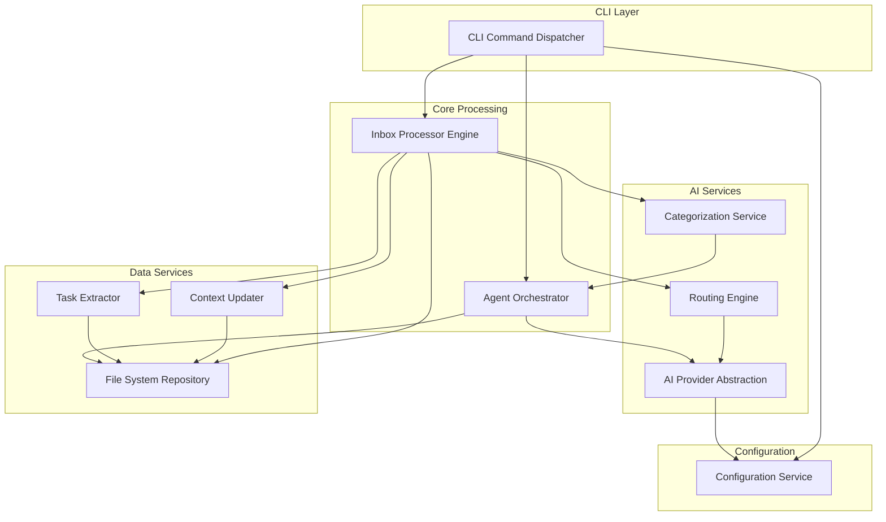

# Components

## Component Architecture Overview

The system follows a **modular monolith pattern** with clear separation of concerns. Components are organized into layers: CLI, Core Processing, AI Services, Data Services, and Configuration.

## Component: CLI Command Dispatcher

**Responsibility:** Entry point for all `tmr` commands. Parses command-line arguments, validates inputs, loads configuration, and delegates to appropriate handlers.

**Key Interfaces:**
- `tmr init` → InitCommand handler
- `tmr process` → InboxProcessorCommand handler
- `tmr watch` → WatchCommand handler
- `tmr team add/archive/fire` → TeamManagementCommand handler
- `tmr project add/archive` → ProjectManagementCommand handler
- `tmr config set-active-provider` → ConfigCommand handler
- `tmr today/this-week/this-month/this-quarter` → TaskViewCommand handler

**Dependencies:** 
- Commander.js for CLI parsing
- ConfigService for user settings
- All command handler modules

**Technology Stack:** TypeScript, Commander.js 12.x, Inquirer 9.x (for interactive prompts)

## Component: Inbox Processor Engine

**Responsibility:** Core processing logic for `tmr process` command. Orchestrates file scanning, AI categorization, routing decisions, context updates, and task extraction.

**Key Interfaces:**
- `processInbox(options?: ProcessOptions): Promise<ProcessResult>` - Main entry point
- `categorizeFile(filePath: string): Promise<CategoryResult>` - Single file categorization
- `routeFile(file: FileMetadata, category: Category): Promise<RoutingDecision>` - Determine destination
- `updateContexts(routingDecision: RoutingDecision): Promise<void>` - Append to context files

**Dependencies:**
- FileSystemRepository (file access)
- CategorizationService (AI-powered classification)
- RoutingEngine (routing logic)
- ContextUpdater (context file management)
- TaskExtractor (action item extraction)

**Technology Stack:** TypeScript, chokidar 3.x (for `tmr watch`), gray-matter 4.x (frontmatter parsing)

**Processing Flow:**
1. Scan `inbox/` for unprocessed files
2. For each file:
   - Parse frontmatter (Granola metadata)
   - Extract email addresses and convert to `[[@email]]` format
   - Call AI for categorization + confidence score via BMAD skill
   - If confidence < threshold: prompt user for confirmation
   - Route file to destination(s)
   - Update related context files via append
   - Extract and file tasks
   - Move original to `archive/` with processing metadata
3. Display processing summary with rationales

## Component: AI Provider Abstraction Layer

**Responsibility:** Unified interface for multiple AI providers (OpenAI, Claude, Gemini). Handles provider selection, API calls, streaming, error handling, and retry logic.

**Key Interfaces:**
- `categorize(transcript: string, context: MinimalContext): Promise<CategorizationResult>` - Categorize transcript
- `generateAgentResponse(prompt: string, agentConfig: AgentConfig): Promise<string>` - Agent command responses
- `extractTasks(content: string): Promise<Task[]>` - Task extraction
- `chat(messages: Message[]): Promise<string>` - Generic AI chat interface

**Dependencies:**
- `openai` 4.x SDK
- `@anthropic-ai/sdk` 0.28.x
- `@google/generative-ai` 0.21.x
- ConfigService (for active provider selection and API keys)

**Technology Stack:** TypeScript with Strategy Pattern implementation

**Provider Selection Logic:**
```typescript
interface AIProvider {
  name: 'openai' | 'claude' | 'gemini';
  categorize(input: string): Promise<CategorizationResult>;
  chat(messages: Message[]): Promise<string>;
}

class AIProviderFactory {
  static create(providerName: string, apiKey: string): AIProvider {
    switch (providerName) {
      case 'openai': return new OpenAIProvider(apiKey);
      case 'claude': return new ClaudeProvider(apiKey);
      case 'gemini': return new GeminiProvider(apiKey);
    }
  }
}
```

## Component: Categorization Service

**Responsibility:** Delegates transcript categorization to BMAD skills (specifically `process-meeting-note` skill). Acts as bridge between Inbox Processor and Agent Orchestrator.

**Key Interfaces:**
- `categorize(file: FileContent, frontmatter: Frontmatter): Promise<CategorizationResult>` - Main categorization entry point

**Dependencies:**
- AgentOrchestrator (to execute BMAD skills)
- FileSystemRepository (to load lightweight identity context)

**Technology Stack:** TypeScript

**Categorization Result Structure:**
```typescript
interface CategorizationResult {
  primaryDestination: string;
  secondaryDestinations: string[];
  confidence: number;
  rationale: string;
  contextUpdates: Array<{
    path: string;
    summary: string;
    topics: string[];
    sentiment: string;
  }>;
  taskExtracts: Task[];
}
```

## Component: Routing Engine

**Responsibility:** Implements confidence-based routing decisions with human-in-the-loop for low-confidence categorizations. Validates destination paths exist.

**Key Interfaces:**
- `route(file: FileMetadata, category: CategoryResult): Promise<RoutingDecision>` - Main routing logic
- `calculateConfidence(category: CategoryResult): number` - Confidence scoring
- `promptUserConfirmation(decision: RoutingDecision): Promise<boolean>` - User approval for low-confidence routes

**Dependencies:**
- FileSystemRepository (to check if destinations exist)
- ConfigService (for confidence threshold settings)

**Technology Stack:** TypeScript, Inquirer 9.x (for user prompts)

## Component: Context Updater

**Responsibility:** Manages append-only updates to `context.md` files for team members, projects, and leaders. Formats context entries consistently and monitors file sizes.

**Key Interfaces:**
- `appendContext(entityPath: string, entry: ContextEntry): Promise<void>` - Append new entry
- `formatContextEntry(entry: ContextEntry): string` - Format entry as markdown
- `checkFileSize(filePath: string): Promise<FileSizeWarning | null>` - Warn on large files (>500KB)

**Dependencies:**
- FileSystemRepository (file I/O)

**Technology Stack:** TypeScript

**File Size Thresholds:**
- Individual transcripts: 50 KB warning
- Context files: 500 KB warning
- Profile files: 10 KB warning

## Component: Task Extractor

**Responsibility:** Processes task extracts from categorization results, categorizes by time horizon, and appends to appropriate task files.

**Key Interfaces:**
- `categorizeByTimeHorizon(task: Task): TimeHorizon` - Determine urgency based on due date
- `appendToTaskFile(task: Task, horizon: TimeHorizon): Promise<void>` - Add to appropriate task list

**Dependencies:**
- FileSystemRepository (to update task files)

**Technology Stack:** TypeScript

**Time Horizon Rules:**
- `today`: Due date is today or overdue
- `this-week`: Due within 7 days
- `this-month`: Due within 30 days
- `this-quarter`: Due within 90 days

## Component: Agent Orchestrator

**Responsibility:** Loads and executes BMAD Builder agent definitions and skills. Manages agent context, command routing, and skill execution.

**Key Interfaces:**
- `loadAgents(agentDir: string): Promise<AgentRegistry>` - Load all BMAD agents from `.tmr-core/agents/`
- `executeAgentCommand(agentId: string, command: string, args: string[]): Promise<string>` - Run agent command
- `executeSkill(skillName: string, context: SkillContext): Promise<any>` - Execute BMAD skill

**Dependencies:**
- BMAD Builder framework (agent parsing and execution)
- AIProviderAbstraction (for agent AI calls)
- FileSystemRepository (to load agent context)

**Technology Stack:** TypeScript, BMAD Builder integration

**Agent Examples:**
- `tmr-people`: Commands like `*1on1-prepare`, `*feedback`, `*pdp-generate`
- `tmr-project`: Commands like `*status-report`, `*risk-assessment`
- `tmr-career`: Commands like `*brag-summarize`, `*self-review`
- `cycle-agent`: Inbox processing coordination

## Component: File System Repository

**Responsibility:** Abstracts all file system operations behind a consistent interface. Enables testing with in-memory filesystem and potential future database migration.

**Key Interfaces:**
- `readFile(path: string): Promise<string>` - Read file contents
- `writeFile(path: string, content: string): Promise<void>` - Write file
- `appendFile(path: string, content: string): Promise<void>` - Append to file
- `ensureDir(path: string): Promise<void>` - Create directory if not exists
- `moveFile(source: string, dest: string): Promise<void>` - Move file (for archiving)
- `listFiles(dir: string, pattern?: string): Promise<string[]>` - List directory contents
- `parseFrontmatter(filePath: string): Promise<Frontmatter>` - Extract YAML frontmatter
- `appendFrontmatter(filePath: string, fields: object): Promise<void>` - Add frontmatter fields

**Dependencies:**
- fs-extra (enhanced filesystem operations)
- gray-matter 4.x (frontmatter parsing)
- unified + remark (for markdown processing)

**Technology Stack:** TypeScript, Repository Pattern

## Component: Configuration Service

**Responsibility:** Manages user configuration including active AI provider, API keys, workspace paths, and processing preferences.

**Key Interfaces:**
- `getActiveProvider(): Promise<ProviderConfig>` - Get current AI provider
- `setActiveProvider(name: string): Promise<void>` - Switch provider
- `addProvider(name: string, apiKey: string, model: string): Promise<void>` - Configure new provider
- `getWorkspacePath(): Promise<string>` - Get Obsidian vault path
- `getConfidenceThreshold(): Promise<number>` - Get routing confidence threshold (default: 0.75)
- `setConfig(key: string, value: any): Promise<void>` - Generic config setter

**Dependencies:**
- `conf` 12.x (cross-platform config storage)
- `crypto-js` 4.x (API key encryption)
- `keytar` 7.x (optional native keychain fallback)

**Technology Stack:** TypeScript

**Config File Location:** `~/.config/tmr/config.json` (XDG-compliant on Linux/macOS, AppData on Windows)

## Component Interaction Diagram



---
