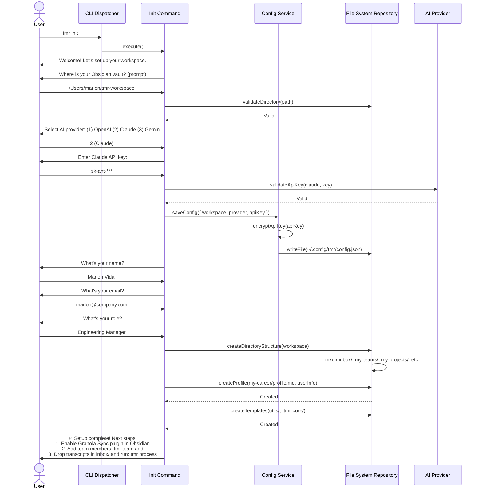
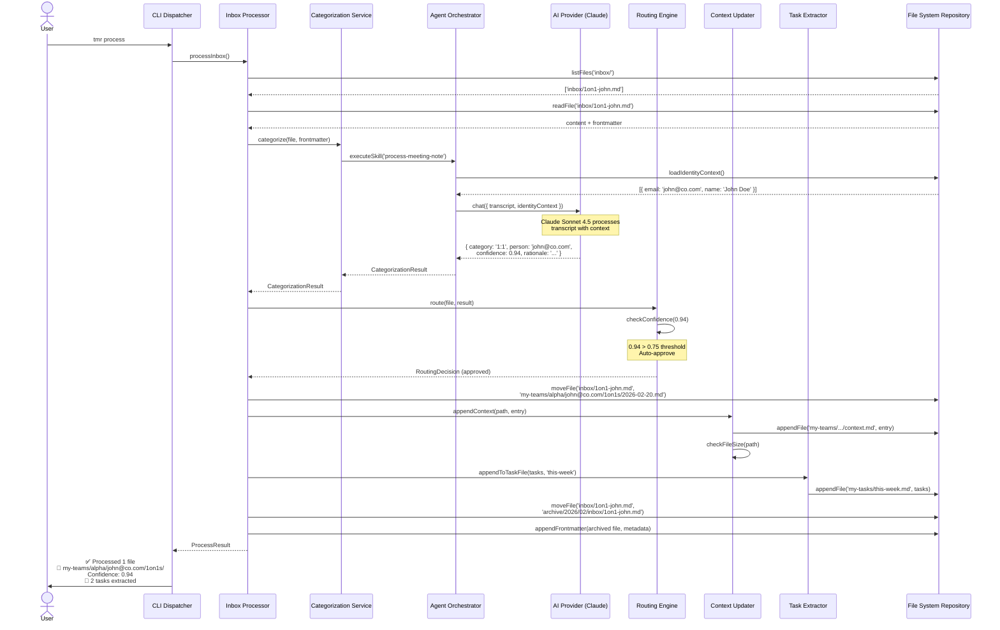
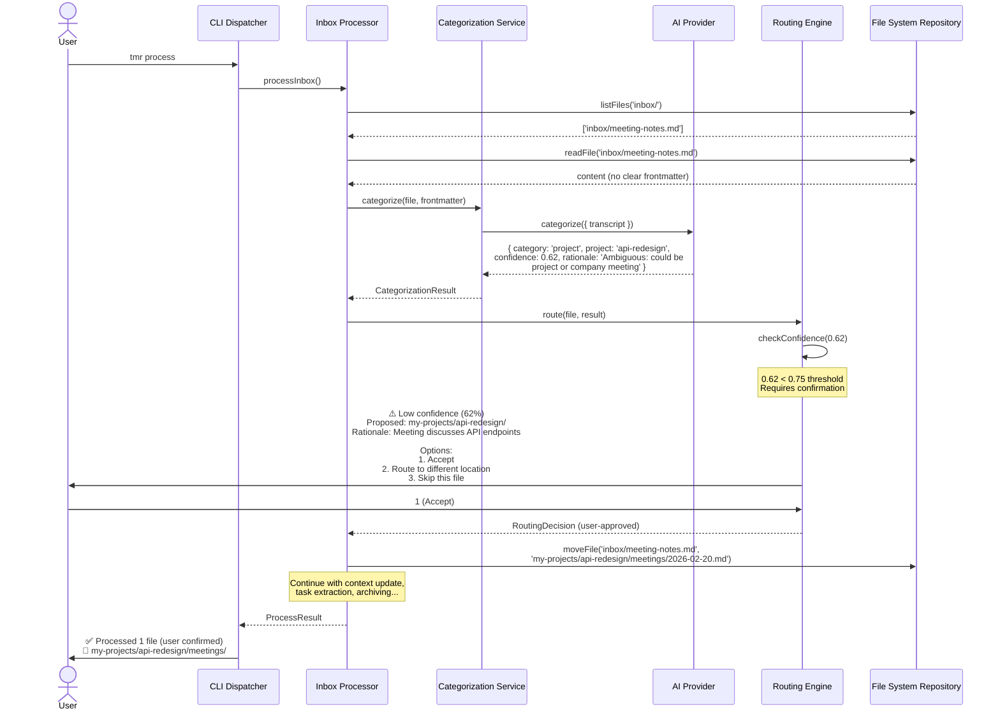
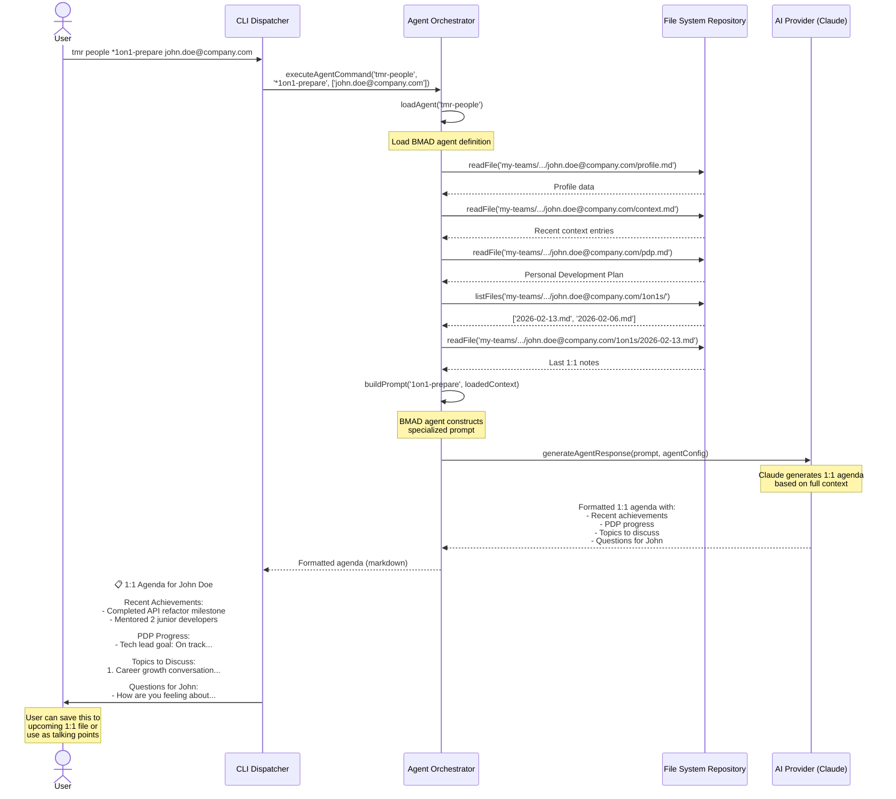
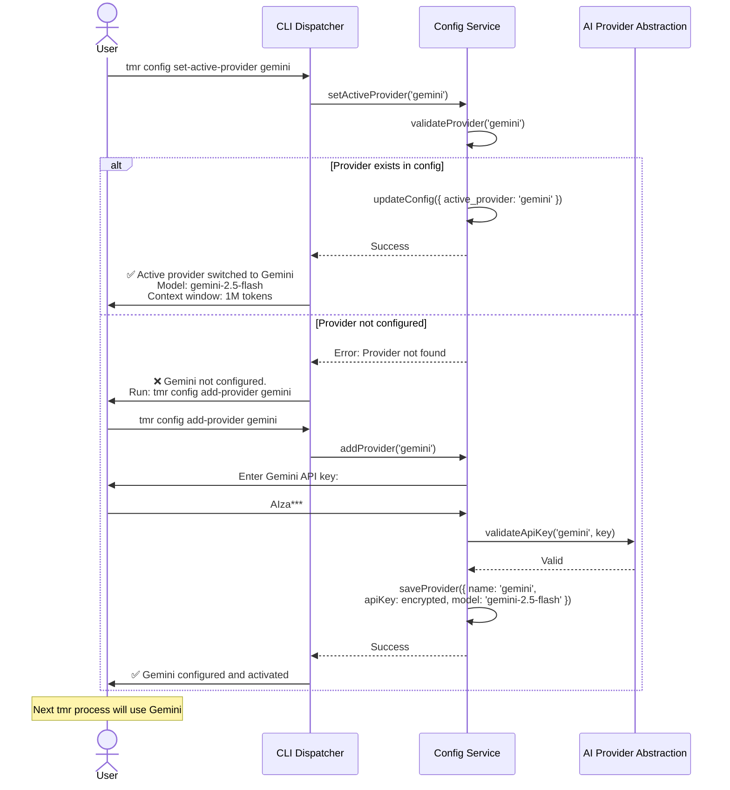
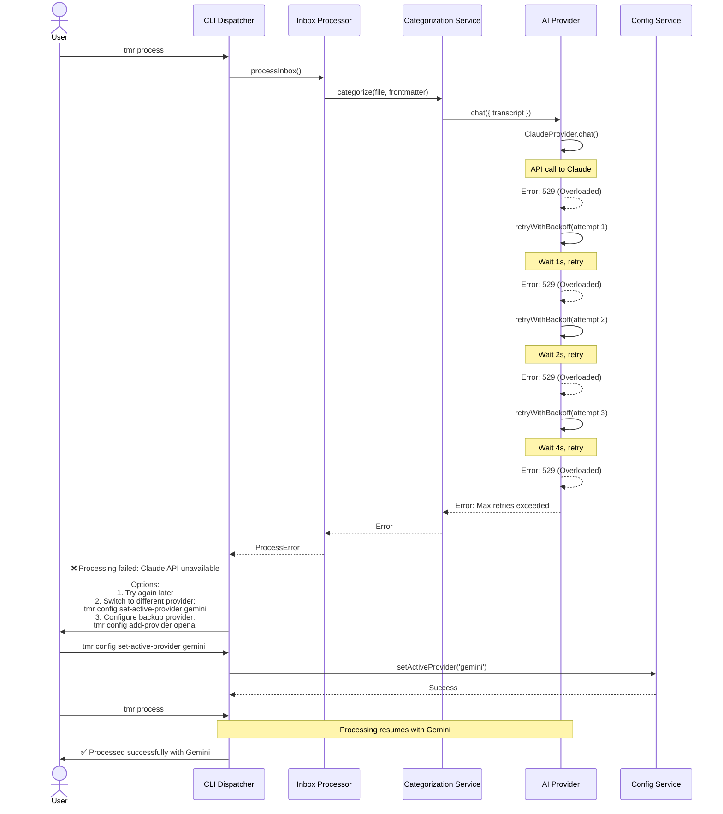

# Core Workflows

## Workflow 1: User Initialization (`tmr init`)

This sequence diagram illustrates the interactive onboarding workflow when a new user initializes Tech Leadership OS.

---

## Workflow 2: Inbox Processing with High Confidence

This sequence shows successful automatic processing when AI categorization confidence exceeds threshold.

---

## Workflow 3: Inbox Processing with Low Confidence (User Confirmation)

This sequence shows human-in-the-loop processing when AI categorization confidence is below threshold.

---

## Workflow 4: Agent Command Execution (`*1on1-prepare`)

This sequence shows how specialized agent commands work with pre-loaded context.

---

## Workflow 5: AI Provider Switching

This sequence shows how users can switch between AI providers at runtime.

---

## Workflow 6: Error Handling - AI Provider Failure

This sequence shows graceful degradation when an AI provider is unavailable.

---
