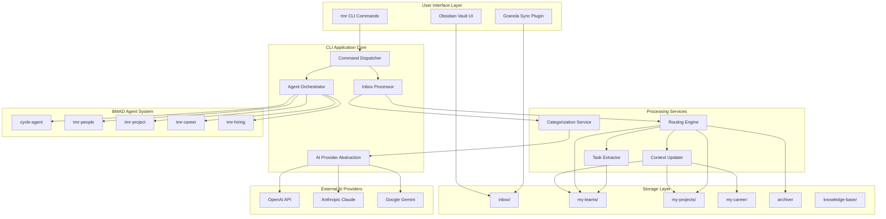

# High Level Architecture

## Technical Summary

Tech Leadership OS is a **local-first CLI and file system-based management workspace** built on Node.js/TypeScript. The architecture follows a **modular monolith pattern** with a command-driven interface (`tmr` CLI), local file system as the primary data store (Obsidian-compatible markdown), and AI agent orchestration powered by the BMAD Builder framework. The system integrates with multiple AI providers (OpenAI, Claude, Gemini) through a provider-agnostic abstraction layer with runtime provider switching support. Core components include: CLI command dispatcher, inbox processing engine, AI categorization service, context maintenance system, and agent orchestration. This architecture directly supports the PRD's goals of zero-latency insights, local-first privacy, and extensible agent-based intelligence while maintaining compatibility with Obsidian as the primary user interface.

## High Level Overview

**Architectural Style:** Modular Monolith with Plugin Architecture

1. **Main Architecture Style:**
   - **Modular Monolith** - Single deployable CLI application with well-defined internal modules
   - **Plugin-based extensibility** via BMAD Builder SKILL.md system
   - **Event-driven processing** for inbox monitoring and file operations
   - **Provider pattern** for AI abstraction (OpenAI/Claude/Gemini)

2. **Repository Structure:**
   - **Monorepo** - Single repository with clear module boundaries
   - Structure: `packages/cli/`, `packages/core/`, `packages/agents/`, `packages/skills/`

3. **Service Architecture:**
   - **Single-process CLI application** with modular internal architecture
   - **No distributed services** - all processing runs locally
   - **File system as database** - structured markdown files with frontmatter metadata
   - **Local-first, offline-capable** by design

4. **Primary User Interaction Flow:**
   - User drops files into `inbox/` (manually or via Granola sync)
   - User runs `tmr process` command (or `tmr watch` for automatic processing)
   - AI analyzes and categorizes each file with confidence scoring
   - System updates context files, extracts tasks, routes to appropriate folders
   - User interacts with Obsidian vault or runs specialized agent commands (`*1on1-prepare`, `*status-report`, etc.)

5. **Key Architectural Decisions:**
   - **Local file system over database:** Enables human readability, git versioning, Obsidian compatibility, zero vendor lock-in
   - **Append-only context updates:** O(1) AI token cost regardless of context size, user controls cleanup
   - **Confidence-gated routing:** Human-in-the-loop for ambiguous categorization decisions
   - **Single-pass AI processing:** Each transcript processed once with minimal context to control costs
   - **Email-as-identity convention:** Consistent `{email}.md` files enable Obsidian graph view resolution
   - **Multi-provider support with runtime switching:** Users can configure multiple AI providers (OpenAI, Claude, Gemini) and switch between them via `tmr config set-active-provider` without reconfiguration
   - **Pure file system for MVP:** Rely on Obsidian's native search capabilities; defer SQLite indexing to future versions if performance requirements emerge
   - **Manual context cleanup:** Defer automated context summarization (`tmr clean-context`) to future versions; users manage file growth manually in MVP

## High Level Project Diagram

## Architectural and Design Patterns

**Key Patterns Guiding the Architecture:**

- **Command Pattern:** CLI commands encapsulated as discrete handlers with validation and execution logic - _Rationale:_ Aligns with Commander.js best practices, enables testability and extensibility

- **Strategy Pattern (AI Provider Abstraction):** Interchangeable AI provider implementations (OpenAI, Claude, Gemini) behind common interface with runtime switching - _Rationale:_ Supports BYOK requirement (FR2) and multi-provider configuration, enables easy provider switching via `tmr config set-active-provider`

- **Plugin Architecture (BMAD Skills):** SKILL.md-based extensibility for community-driven features - _Rationale:_ Core requirement for extensibility (FR8), enables community contributions without modifying core code

- **Repository Pattern (File System Access):** Abstract file system operations behind consistent API - _Rationale:_ Enables testing with in-memory filesystem, potential future migration to database if needed

- **Event-Driven Processing:** File watcher emits events for inbox changes, handlers respond asynchronously - _Rationale:_ Supports `tmr watch` requirement (FR5), decouples detection from processing

- **Confidence-Based Human-in-the-Loop:** AI decisions include confidence scores; low-confidence triggers user confirmation - _Rationale:_ Balances automation with accuracy (FR4), builds user trust over time

- **Append-Only Context Pattern:** Context files grow by appending dated entries, never require full read for updates - _Rationale:_ Keeps token costs O(1) regardless of context size (PRD brainstorm outcomes)

---
